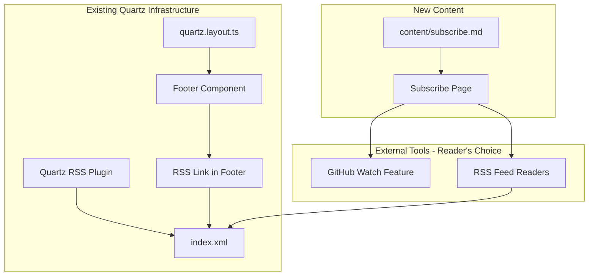
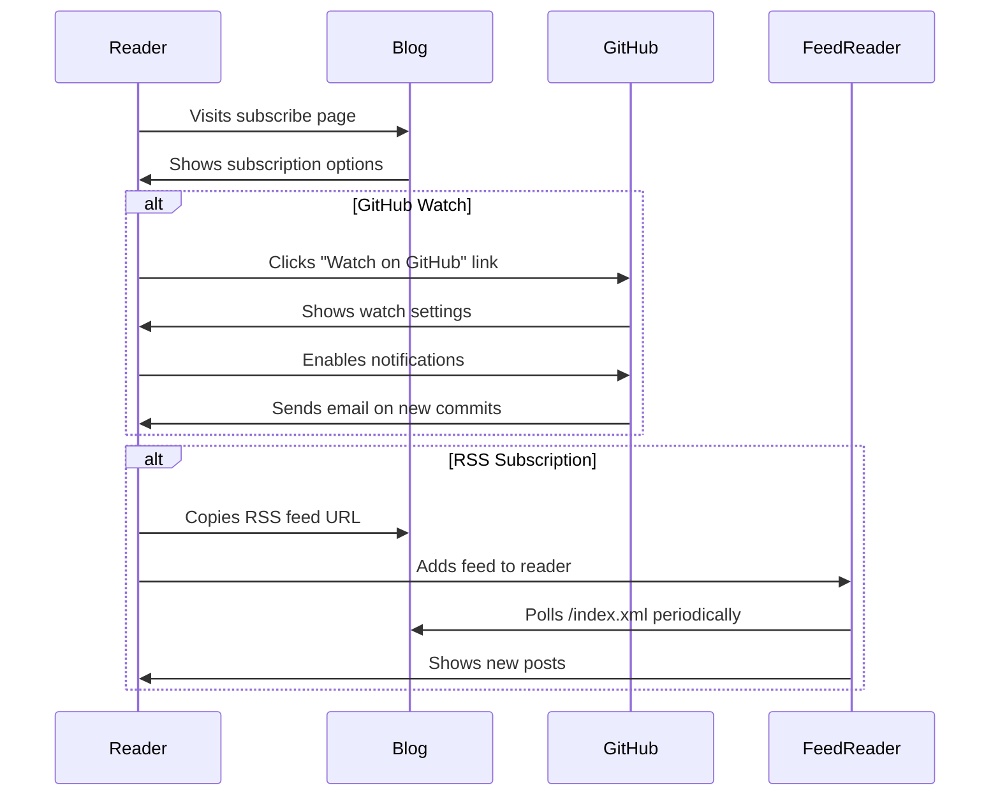

# Design Document: Blog Subscription Notifications

## Overview

This design implements a minimal subscription documentation system for "The Data Pipeline Doctrine" blog. Rather than building custom infrastructure, this approach documents existing notification options (GitHub Watch and RSS) that readers can use to stay updated.

The implementation consists of two parts:
1. A dedicated subscribe page (`content/subscribe.md`) with instructions for using GitHub Watch and RSS readers
2. An RSS link in the site footer (already configured in `quartz.layout.ts`)

### Key Design Decisions

| Decision | Choice | Rationale |
|----------|--------|-----------|
| Subscription method | Documentation only | Zero infrastructure, leverages existing GitHub/Quartz features |
| RSS link placement | Footer via Quartz config | Already implemented, visible on all pages |
| Custom components | None | Not needed—standard Quartz configuration suffices |
| Email service | None | Violates zero-cost requirement, adds maintenance burden |

## Architecture

The subscription feature uses existing Quartz infrastructure with no custom components:



### User Flow



## Components and Interfaces

### Footer Configuration (Existing)

The RSS link is already configured in `quartz.layout.ts`:

```typescript
footer: Component.Footer({
  links: {
    GitHub: "https://github.com/davidtwu",
    RSS: "/index.xml",
  },
}),
```

No changes required to the footer configuration.

### Subscribe Page Structure

The subscribe page (`content/subscribe.md`) follows standard Quartz content conventions:

```markdown
---
title: Subscribe
description: How to get notified when new posts are published
---

# Subscribe to The Data Pipeline Doctrine

[Introduction paragraph]

## Option 1: RSS Feed

[Instructions for RSS subscription with links to popular readers]

## Option 2: GitHub Watch

[Instructions for using GitHub's Watch feature]

## Which Should I Choose?

[Comparison table or guidance]
```

### Subscribe Page Content Sections

| Section | Purpose | Content |
|---------|---------|---------|
| Introduction | Explain available options | Brief overview of RSS and GitHub Watch |
| RSS Feed | Primary subscription method | Feed URL, links to Feedly/Inoreader/NetNewsWire with setup instructions |
| GitHub Watch | Alternative method | Link to repo watch settings, explanation of notification types |
| Comparison | Help readers choose | When to use each method |

## Data Models

This feature introduces no new data models. All functionality uses existing Quartz and GitHub features:

| Data | Source | Storage | Consumer |
|------|--------|---------|----------|
| Blog posts | `content/*.md` | Git repository | Quartz build |
| RSS feed | Quartz RSS plugin | `/index.xml` (static) | Feed readers |
| Watch notifications | GitHub | GitHub servers | GitHub notification system |

## Error Handling

Since this feature is documentation-only with no custom code, error handling is minimal:

| Scenario | Behavior |
|----------|----------|
| RSS feed not generated | Quartz handles this by default—no action needed |
| GitHub repo unavailable | External dependency—link still works when GitHub is up |
| JavaScript disabled | Full functionality maintained (all content is static HTML) |

## Testing Strategy

### Manual Verification Checklist

Since this feature involves only content and existing configuration, testing is manual:

**Subscribe Page (`content/subscribe.md`)**
- [ ] Page renders correctly at `/subscribe`
- [ ] Page is accessible from site navigation
- [ ] RSS feed link (`/index.xml`) is correct and clickable
- [ ] GitHub repository link is correct and clickable
- [ ] External feed reader links (Feedly, Inoreader, NetNewsWire) work
- [ ] Page renders correctly without JavaScript
- [ ] Page displays correctly on mobile devices

**Footer RSS Link**
- [ ] RSS link appears in footer on all pages
- [ ] Clicking RSS link navigates to `/index.xml`
- [ ] RSS feed contains recent posts
- [ ] Footer displays correctly on mobile

**Visual Consistency**
- [ ] Subscribe page matches site typography and colors
- [ ] No custom CSS required (uses Quartz defaults)

### Build Verification

```bash
# Build the site and verify subscribe page exists
npx quartz build
ls public/subscribe/index.html  # Should exist

# Verify RSS feed exists
ls public/index.xml  # Should exist
```

### Browser Testing

Test in the following browsers:
- Chrome (desktop and mobile)
- Firefox
- Safari (if available)

Verify:
- Page loads without errors
- All links are functional
- Layout is responsive
