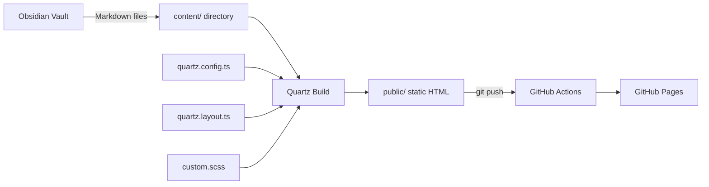
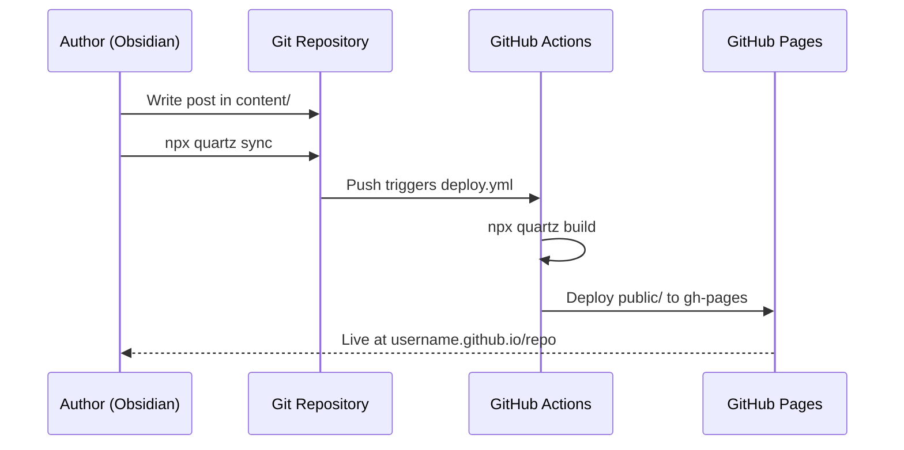

# Design Document

## Overview
Build a personal technical blog using Quartz v4, a Node.js static site generator purpose-built for publishing Obsidian vaults. The site renders Markdown content with YAML frontmatter into a fast, searchable, dark-themed static website hosted on GitHub Pages. All customization is achieved through Quartz's configuration files (`quartz.config.ts`, `quartz.layout.ts`) and a single custom SCSS file — no modifications to Quartz core internals.

## Architecture



### Content Flow


## Components and Interfaces

### 1. Configuration Layer (`quartz.config.ts`)
The primary configuration file controlling site metadata, plugins, and theme.

```typescript
// Pseudocode for quartz.config.ts configuration
const config: QuartzConfig = {
  configuration: {
    pageTitle: "The Data Pipeline Doctrine",
    enableSPA: true,
    enablePopovers: true,
    analytics: null,
    locale: "en-US",
    baseUrl: "{username}.github.io/{repo}",
    ignorePatterns: ["private", "templates", ".obsidian", "blog-ideas.md"],
    defaultDateType: "created",
    theme: {
      fontOrigin: "googleFonts",
      cdnCaching: true,
      typography: {
        header: "Instrument Serif",
        body: "DM Sans",
        code: "JetBrains Mono",
      },
      colors: {
        darkMode: {
          light: "#0D0D0D",        // page background
          lightgray: "#1A1A1A",    // borders, card backgrounds  
          gray: "#4A4A4A",         // graph links, heavier borders
          darkgray: "#9B9589",     // body text secondary
          dark: "#E8E4DF",         // header text, primary text
          secondary: "#CA9B5A",    // links, accent color (warm gold)
          tertiary: "#DAB06A",     // hover states
          highlight: "#CA9B5A15",  // internal link background
          textHighlight: "#CA9B5A30", // search result highlighting
        },
      },
    },
  },
  plugins: {
    transformers: [
      // Standard Quartz transformer plugins
      "Plugin.FrontMatter()",
      "Plugin.CreatedModifiedDate({ priority: ['frontmatter'] })",
      "Plugin.SyntaxHighlighting({ theme: { dark: 'github-dark' } })",
      "Plugin.ObsidianFlavoredMarkdown({ enableInHtmlEmbed: false })",
      "Plugin.GitHubFlavoredMarkdown()",
      "Plugin.TableOfContents()",
      "Plugin.CrawlLinks({ markdownLinkResolution: 'shortest' })",
      "Plugin.Description()",
      "Plugin.Latex({ renderEngine: 'katex' })",
    ],
    filters: [
      "Plugin.RemoveDrafts()",     // Excludes draft: true posts
    ],
    emitters: [
      "Plugin.AliasRedirects()",
      "Plugin.ComponentResources()",
      "Plugin.ContentPage()",
      "Plugin.FolderPage()",
      "Plugin.TagPage()",          // Auto-generates /tags/{tag} pages
      "Plugin.ContentIndex({ enableRSS: true, enableSiteMap: true })",
      "Plugin.Assets()",
      "Plugin.Static()",
      "Plugin.NotFoundPage()",
    ],
  },
}
```

### 2. Layout Layer (`quartz.layout.ts`)
Controls page structure — what appears in header, sidebar, and footer.

```typescript
// Pseudocode for layout configuration
export const sharedPageComponents = {
  head: Component.Head(),
  header: [],
  afterBody: [
    Component.Backlinks(),          // Show backlinks on every post
    Component.Graph(),              // Interactive backlink graph
    Component.Comments({ provider: 'giscus' }),  // Optional, for later
  ],
  footer: Component.Footer({
    links: {
      "GitHub": "https://github.com/{username}",
      "RSS": "/index.xml",
    },
  }),
}

export const defaultContentPageLayout = {
  beforeBody: [
    Component.Breadcrumbs(),
    Component.ArticleTitle(),
    Component.ContentMeta(),        // Date, reading time, tags
    Component.TagList(),
  ],
  left: [
    Component.PageTitle(),
    Component.MobileOnly(Component.Spacer()),
    Component.Search(),
    Component.Darkmode(),           // Theme toggle (dark is default)
    Component.DesktopOnly(Component.Explorer()),
  ],
  right: [
    Component.DesktopOnly(Component.TableOfContents()),
    Component.DesktopOnly(Component.Graph()),
  ],
}
```

### 3. Styling Layer (`quartz/styles/custom.scss`)
Custom SCSS overrides applied on top of Quartz defaults.

```scss
// Pseudocode for custom.scss
// -- Typography refinements --
// Increase body line-height to 1.75 for readability
// Set article max-width to ~680px for comfortable reading
// Style code blocks with subtle border and slightly lighter background

// -- Dark theme polish --
// Style blockquotes with left border in accent color (#CA9B5A)
// Style horizontal rules as subtle gradient dividers
// Ensure Mermaid diagrams use theme-compatible colors

// -- Tag pills --
// Style tag links as small rounded pills with accent color background

// -- Reading experience --
// Add spacing between paragraphs for scanability
// Style external links with subtle indicator icon
// Ensure images have rounded corners and subtle shadow
```

### 4. Content Layer (`content/`)

| File | Type | Published | Description |
|------|------|-----------|-------------|
| `index.md` | Landing page | Yes | Blog intro + auto-generated recent posts |
| `about.md` | Static page | Yes | Author bio and blog purpose |
| `blog-ideas.md` | Idea capture | No (`draft: true`) | Running list of post ideas |
| `why-im-starting-this-blog.md` | Meta post | Yes | First published post |
| `til-leverage-hierarchy-for-engineering.md` | TIL post | Yes | Sample TIL post |

### 5. Template Layer (`templates/`)

Three Obsidian Templater-compatible templates excluded from build via `ignorePatterns`. Each template contains YAML frontmatter with `{{title}}` and `{{date}}` Templater variables, and Markdown section headers matching the content type structure.

## Data Models

### Post Frontmatter Schema
```yaml
---
title: string          # Required. Display title.
date: YYYY-MM-DD       # Required. Publication date.
tags: string[]          # Optional. Array of tag slugs.
draft: boolean          # Optional. Default false. If true, excluded from build.
description: string     # Optional. Used for meta description and post list preview.
aliases: string[]       # Optional. URL redirects for renamed posts.
---
```

### Quartz Auto-Generated Data
- **Tag index pages**: One page per unique tag at `/tags/{tag-slug}`
- **RSS feed**: `/index.xml` with all published posts
- **Sitemap**: `/sitemap.xml` for SEO
- **Search index**: Client-side full-text search index (FlexSearch)
- **Content graph**: JSON graph of all internal links for graph visualization

## Error Handling
- WHEN a wikilink targets a non-existent page, Quartz renders a "dead link" with distinctive styling (no 404)
- WHEN a Mermaid diagram has syntax errors, the raw code block is displayed as fallback
- WHEN `npx quartz build` encounters invalid frontmatter, it logs a warning and skips the file
- WHEN GitHub Actions build fails, the previous deployment remains live (GitHub Pages does not tear down on failure)

## Testing Strategy
- **Build test**: `npx quartz build` completes without errors
- **Content rendering**: Manual verification that sample posts render correctly with frontmatter, tags, wikilinks, and Mermaid diagrams
- **Mobile responsiveness**: Manual check at 375px, 768px, and 1440px viewports
- **Link validation**: Verify internal links resolve, external links open in new tabs
- **Draft exclusion**: Confirm `blog-ideas.md` does NOT appear on the published site
- **RSS validation**: Validate `/index.xml` against W3C Feed Validation Service
- **Search**: Verify full-text search returns results for content in sample posts
- **Performance**: Lighthouse score ≥ 90 on Performance, Accessibility, Best Practices, SEO
