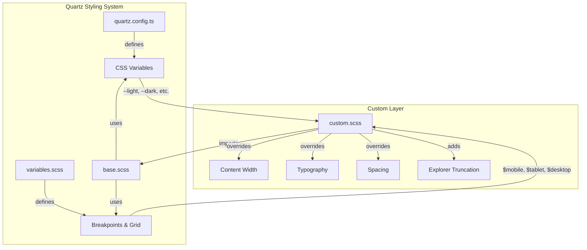

# Design Document: Visual Refresh

## Overview

This design document describes the implementation of a visual refresh for The Data Pipeline Doctrine blog. The refresh enhances the site's professional appearance through expanded content width, refined typography, improved spacing, and explorer sidebar fixes—all achieved through CSS customizations in `quartz/styles/custom.scss` without modifying Quartz core files.

The design leverages Quartz v4's existing CSS variable system and responsive breakpoints while extending styles to meet the requirements for a principal engineer's technical blog.

## Architecture

The visual refresh follows a pure CSS approach, layering custom styles on top of Quartz's base styling system:



### Design Principles

1. **Non-invasive customization**: All changes in `custom.scss`, no Quartz core modifications
2. **Progressive enhancement**: Mobile-first responsive design using existing breakpoints
3. **Variable reuse**: Leverage existing CSS variables (`--secondary`, `--tertiary`, etc.) for consistency
4. **Specificity management**: Use targeted selectors to override base styles without `!important` where possible

### Responsive Breakpoints (from Quartz)

| Breakpoint | Width | Layout |
|------------|-------|--------|
| Mobile | < 800px | Single column, full width |
| Tablet | 800px - 1200px | Two columns (sidebar + content) |
| Desktop | ≥ 1200px | Three columns (left sidebar + content + right sidebar) |

## Components and Interfaces

### 1. Content Area Width Component

Modifies `.center > article` to expand content width while maintaining readability.

```scss
// Interface: Content width configuration
.center > article {
  max-width: 750px;  // Expanded from 680px
  
  @media (min-width: 1200px) {
    max-width: 750px;
  }
  
  @media (min-width: 800px) and (max-width: 1200px) {
    max-width: 100%;  // Fill available space
  }
  
  @media (max-width: 800px) {
    max-width: 100%;
    padding: 0 1rem;
  }
}
```

### 2. Typography Component

Refines line-height, paragraph spacing, and heading hierarchy.

```scss
// Interface: Typography configuration
article {
  p, li, td, tbody {
    line-height: 1.7;  // Within 1.6-1.8 range
  }
  
  p {
    margin-bottom: 1.4em;  // Clear paragraph separation
  }
}

// Heading hierarchy (inherits from base.scss, enhanced)
h1 { font-size: 2rem; margin-top: 2.5rem; }
h2 { font-size: 1.5rem; margin-top: 2rem; }
h3 { font-size: 1.25rem; margin-top: 1.75rem; }
```

### 3. Spacing and Whitespace Component

Establishes consistent vertical rhythm and element spacing.

```scss
// Interface: Spacing configuration
pre {
  padding: 1rem;
  margin: 1.5rem 0;
}

blockquote {
  margin: 1.5rem 0;
  padding: 0.75rem 1rem;
}

article img {
  margin: 1.5rem 0;
}
```

### 4. Explorer Sidebar Truncation Component

Adds text truncation with ellipsis for long titles in the explorer sidebar.

```scss
// Interface: Explorer truncation
.explorer-content {
  li > a,
  .folder-container div > a,
  .folder-container div > button span {
    white-space: nowrap;
    overflow: hidden;
    text-overflow: ellipsis;
    max-width: 100%;
    display: block;
  }
}
```

## Data Models

### CSS Variable Dependencies

The design relies on these existing CSS variables from `quartz.config.ts`:

| Variable | Dark Mode Value | Usage |
|----------|-----------------|-------|
| `--light` | `#0D0D0D` | Background color |
| `--lightgray` | `#1A1A1A` | Code block backgrounds, borders |
| `--gray` | `#4A4A4A` | Muted text, borders |
| `--darkgray` | `#9B9589` | Body text color |
| `--dark` | `#E8E4DF` | Headings, strong text |
| `--secondary` | `#CA9B5A` | Links, accents |
| `--tertiary` | `#DAB06A` | Hover states |
| `--highlight` | `#CA9B5A15` | Selection, highlights |

### Breakpoint Variables

From `quartz/styles/variables.scss`:

| Variable | Value | Media Query |
|----------|-------|-------------|
| `$mobile` | `max-width: 800px` | Mobile styles |
| `$tablet` | `800px - 1200px` | Tablet styles |
| `$desktop` | `min-width: 1200px` | Desktop styles |
| `$sidePanelWidth` | `320px` | Sidebar width |

### Content Width Constraints

| Viewport | Content Max-Width | Characters per Line |
|----------|-------------------|---------------------|
| Desktop (≥1200px) | 750px | ~75-85 chars |
| Tablet (800-1200px) | 100% (minus sidebar) | ~65-80 chars |
| Mobile (<800px) | 100% | ~45-65 chars |


## Correctness Properties

*A property is a characteristic or behavior that should hold true across all valid executions of a system—essentially, a formal statement about what the system should do. Properties serve as the bridge between human-readable specifications and machine-verifiable correctness guarantees.*

### Property 1: Desktop Content Width

*For any* page viewed at desktop viewport width (≥1200px), the content area (`.center > article`) should have a computed max-width of at least 750px.

**Validates: Requirements 1.1**

### Property 2: Tablet Content Width

*For any* page viewed at tablet viewport width (800px-1200px), the content area should expand to fill available horizontal space (max-width: 100% or equivalent).

**Validates: Requirements 1.2**

### Property 3: Mobile Content Width

*For any* page viewed at mobile viewport width (<800px), the content area should use 100% of available width with horizontal padding applied.

**Validates: Requirements 1.3**

### Property 4: Text Contrast Ratio

*For any* body text element (p, li, td) and its background, the contrast ratio between text color and background color should be at least 4.5:1 (WCAG AA).

**Validates: Requirements 2.1**

### Property 5: Link Color Distinction

*For any* link element within article content, the computed color should differ from the body text color by a perceptible amount (different hue or sufficient luminance difference).

**Validates: Requirements 2.3**

### Property 6: Code Block Background Separation

*For any* code block (`pre` element), the background color should differ from the page background color (`--light` variable).

**Validates: Requirements 2.4**

### Property 7: Body Text Line Height

*For any* body text element (p, li, td, tbody) within an article, the computed line-height should be between 1.6 and 1.8 (relative to font-size).

**Validates: Requirements 3.1**

### Property 8: Heading Size Hierarchy

*For any* set of headings (h1, h2, h3, h4), the font-size should decrease monotonically: h1 > h2 > h3 > h4.

**Validates: Requirements 3.3**

### Property 9: Blockquote Visual Distinction

*For any* blockquote element, there should be a visible border-left or distinct background color that differentiates it from regular paragraph text.

**Validates: Requirements 4.3**

### Property 10: Explorer Item Truncation

*For any* explorer sidebar item (page link or folder name), the CSS should include `text-overflow: ellipsis`, `overflow: hidden`, and `white-space: nowrap` to enable truncation when content exceeds available width.

**Validates: Requirements 5.1, 5.2**

## Error Handling

### CSS Fallbacks

| Scenario | Fallback Behavior |
|----------|-------------------|
| CSS variable undefined | Browser uses inherited or initial value |
| Breakpoint media query unsupported | Desktop styles apply (graceful degradation) |
| `text-overflow: ellipsis` unsupported | Text wraps or overflows (older browsers) |
| Custom font fails to load | System font stack applies |

### Browser Compatibility

The design uses CSS features with broad support:
- CSS Custom Properties (variables): 96%+ browser support
- Media queries: 99%+ browser support
- `text-overflow: ellipsis`: 98%+ browser support
- Flexbox: 99%+ browser support

No polyfills or JavaScript fallbacks are required.

### Validation Approach

1. **Build-time**: SCSS compilation catches syntax errors
2. **Visual testing**: Manual review at each breakpoint (mobile, tablet, desktop)
3. **Accessibility audit**: Browser dev tools contrast checker for WCAG compliance

## Testing Strategy

### Unit Tests (Examples and Edge Cases)

Unit tests verify specific styling outcomes:

1. **Code block padding exists**: Verify `pre` elements have non-zero padding
2. **Image margins applied**: Verify `article img` has vertical margins
3. **Monospace font on code**: Verify `code` and `pre` use `--codeFont` variable

### Property-Based Tests

Property-based tests verify universal properties across generated inputs using a CSS testing library (e.g., Playwright for computed style verification).

**Configuration**:
- Minimum 100 iterations per property test
- Test across viewport sizes: 375px, 768px, 1024px, 1440px
- Tag format: `Feature: visual-refresh, Property {N}: {description}`

**Property Test Implementation Approach**:

```typescript
// Example property test structure (Playwright)
test.describe('visual-refresh properties', () => {
  // Feature: visual-refresh, Property 1: Desktop Content Width
  test('content area has min 750px max-width on desktop', async ({ page }) => {
    await page.setViewportSize({ width: 1440, height: 900 });
    await page.goto('/');
    const maxWidth = await page.locator('.center > article').evaluate(
      el => getComputedStyle(el).maxWidth
    );
    expect(parseInt(maxWidth)).toBeGreaterThanOrEqual(750);
  });
  
  // Feature: visual-refresh, Property 7: Body Text Line Height
  test('body text line-height is between 1.6 and 1.8', async ({ page }) => {
    await page.goto('/');
    const elements = page.locator('article p, article li');
    for (const el of await elements.all()) {
      const lineHeight = await el.evaluate(e => {
        const style = getComputedStyle(e);
        return parseFloat(style.lineHeight) / parseFloat(style.fontSize);
      });
      expect(lineHeight).toBeGreaterThanOrEqual(1.6);
      expect(lineHeight).toBeLessThanOrEqual(1.8);
    }
  });
});
```

### Visual Regression Testing

For subjective requirements (2.2, 3.2, 4.1, 4.4), use visual regression testing:

1. Capture baseline screenshots at each breakpoint
2. Compare against future changes to detect unintended regressions
3. Manual review for aesthetic qualities

### Test Coverage Matrix

| Requirement | Property Test | Unit Test | Visual Test |
|-------------|---------------|-----------|-------------|
| 1.1 Desktop width | ✓ Property 1 | | |
| 1.2 Tablet width | ✓ Property 2 | | |
| 1.3 Mobile width | ✓ Property 3 | | |
| 1.4 Line length | | | ✓ Manual |
| 2.1 Contrast ratio | ✓ Property 4 | | |
| 2.2 Professional colors | | | ✓ Manual |
| 2.3 Link distinction | ✓ Property 5 | | |
| 2.4 Code separation | ✓ Property 6 | | |
| 3.1 Line height | ✓ Property 7 | | |
| 3.2 Paragraph spacing | | | ✓ Manual |
| 3.3 Heading hierarchy | ✓ Property 8 | | |
| 3.4 Code font | | ✓ Example | |
| 4.1 Vertical rhythm | | | ✓ Manual |
| 4.2 Code padding | | ✓ Example | |
| 4.3 Blockquote style | ✓ Property 9 | | |
| 4.4 Image treatment | | ✓ Example | |
| 5.1 Page truncation | ✓ Property 10 | | |
| 5.2 Folder truncation | ✓ Property 10 | | |
| 5.3 No false truncation | | | ✓ Edge case |
| 5.4 Link navigation | | | ✓ Manual |
