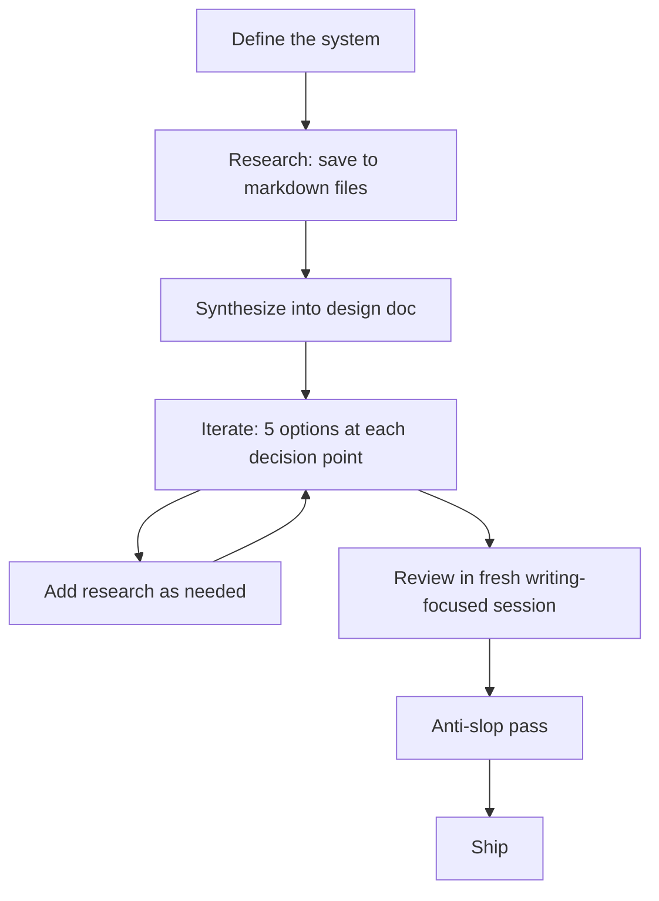

I started using Kiro CLI for design documents expecting it to be a faster way to write. Research a topic, generate prose, ship. What I got was different — and more useful.

Here are three things that surprised me.

## Surprise 1: The agent generates better options than I would

I used to ask the agent for a recommendation. "What database should I use for this?" It would pick one, explain why, and I'd move on.

Then I tried asking for 5 options instead.

The [[tree-of-thoughts-for-architecture-decisions|Tree of Thoughts research]] suggests 5 is the sweet spot — enough diversity to cover the solution space, not so many that evaluation becomes noise. When I applied this to a recent design (choosing between event streaming approaches), option 4 was something I hadn't considered. It ended up being the right choice.

The surprise: the agent's value isn't in deciding. It's in expanding the solution space beyond my own blind spots. I still make the call — I know my team's skills, our operational capacity, the political realities. But I'm choosing from a better set of options than I would have generated alone.

## Surprise 2: Research creates a living knowledge base

I expected research to be a means to an end. Gather info, write the doc, move on.

Instead, I started saving research to a `research/` folder — one markdown file per topic. `kinesis-vs-msk.md`. `redshift-streaming-ingestion.md`. The agent writes its findings there, and I can reload them in future sessions.

The folder grows. When a question comes up mid-design that wasn't covered, I send the agent back to investigate and add a new file. When I revisit the design months later, I don't start from zero. When I start a related project, half the research is already done.

The surprise: I'm not just producing a document. I'm accumulating reusable context that compounds across projects.

## Surprise 3: A writing-focused agent is an unbiased reviewer

I expected review to be a formality. Maybe catch a typo.

Instead, I started spinning up a fresh agent session after the design felt complete. No shared context with the research phase. I paste the document and ask it to review for clarity, structure, and gaps — with a prompt tuned for writing quality, not technical correctness.

It reads cold, like my actual audience will. It asks "what does X mean?" about terms I'd internalized but never defined. It flags sections that made sense during research but weren't explained in the final doc.

Better yet, I can develop that reviewer over time. Add guidelines for my team's style. Add my personal [[anti-slop-part-1-what-is-ai-slop|anti-slop rules]]. The reviewer becomes a customizable editorial voice — unbiased because it has no memory of my research, but aligned because I've shaped its criteria.

The surprise: context is a liability during review, not an asset. Throwing it away is the feature.

## The workflow

For reference, here's what the full process looks like now:

The [[anti-slop-part-3-the-anti-slop-workflow|anti-slop pass]] is its own step — reading end-to-end and rewriting in my voice. Agent prose has tells. Cleaning them up is the difference between a doc that gets read and one that gets skimmed.

## The one-liner

The agent doesn't replace my judgment. It gives me better inputs to judge with.

