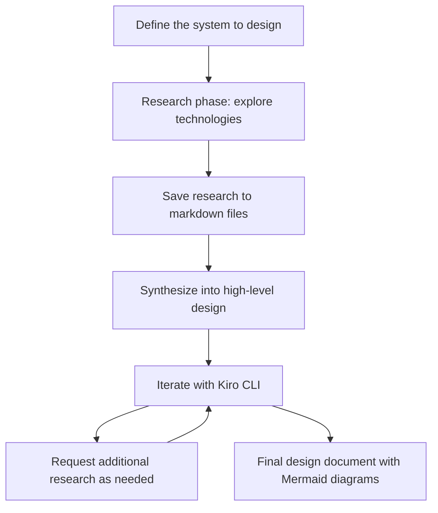

I've been experimenting with a new approach to creating technical design documents, and it's changed how I think about the design process entirely. Instead of context-switching between browser tabs, note-taking apps, and diagramming tools, I now run the entire workflow through Kiro CLI with Claude Opus 4.5.

The results have been surprisingly good — detailed, well-researched designs that would have taken me days to produce manually.

## The workflow

Here's the approach I've landed on:

### Phase 1: Research

I start by opening Kiro CLI and describing the system I'm designing. Then I ask it to research the relevant technologies — databases, messaging systems, cloud services, whatever the design requires. The key is having it save each technology's research to a separate markdown file under a `research/` folder.

For example, if I'm designing a real-time analytics pipeline on AWS, I might end up with:
- `research/kinesis-data-streams-vs-msk.md`
- `research/redshift-streaming-ingestion.md`
- `research/aws-glue-vs-emr-serverless.md`

Each file contains the agent's findings: capabilities, trade-offs, pricing considerations, and relevant benchmarks it found. This creates a persistent knowledge base I can reference throughout the design process.

### Phase 2: Synthesis

Once the research is complete, I ask Kiro to synthesize everything into a high-level design document. This is where the magic happens — the agent has all the context from the research phase and can make informed recommendations.

I specifically ask for Mermaid diagrams to visualize:
- System architecture
- Data flow
- Component interactions
- Deployment topology

### Phase 3: Iteration

This is where the agentic approach really shines. I can have a conversation with the design:

- "What happens if we need to handle 10x the throughput?"
- "What are the cost implications of this architecture at scale?"
- "Add a section on failure modes and recovery"

Each iteration builds on the previous context. If a question requires more research, I send the agent back to investigate and update the research files.

## Why this works

Traditional design document creation is a serial process: research, then write, then diagram, then revise. The agentic approach parallelizes this — the agent can research while I'm thinking about requirements, and it maintains context across the entire session.

The research folder approach is crucial. It creates artifacts I can review, share with teammates, and reference in future designs. It also keeps the agent honest — I can verify its claims against the source material.

## The one-liner

Design documents are now a conversation with an agent that has infinite patience for research and perfect memory of context.

