In [[anti-slop-part-1-what-is-ai-slop|Part 1]], I defined AI slop and explained why it matters. Now let's get practical: what does slop actually look like, and how do you recognize it in your own writing?

## The Wikipedia list

Wikipedia recently published a guide to detecting AI-generated content. Their list maps well to technical writing:

### 1. Overemphasis on importance

AI inflates significance. Every topic "plays a vital role," "serves as a testament," or "leaves a lasting impact."

Bad:
> "This migration represents a watershed moment in our platform's evolution, fundamentally transforming how we approach data processing."

It's a migration. It might be important. But "watershed moment" and "fundamentally transforming" are doing no work here — they're just importance-signaling.

Good:
> "This migration moves us from batch to streaming. Query latency drops from minutes to seconds."

### 2. Vague attributions

AI invents authorities when it lacks sources. "Industry experts say," "some critics argue," "observers have noted."

In technical writing, this shows up as:
> "Best practices suggest..." 
> "It's widely accepted that..."
> "Modern architectures typically..."

If you can't name the source, either find one or drop the appeal to authority. Your reader knows you're hedging.

### 3. False ranges

The "from X to Y" construction appears constantly when AI tries to sound comprehensive.

Bad:
> "Our platform handles everything from real-time analytics to batch processing to machine learning workloads."

This says nothing about what it actually does well. It's a list disguised as a capability statement.

### 4. Section summaries

AI habitually restates what it just explained.

Bad:
> "In summary, the new architecture provides better performance, improved reliability, and enhanced scalability."

If your reader can't retain information for three paragraphs, the problem isn't the lack of a summary — it's that the preceding paragraphs weren't clear.

### 5. Editorializing

AI can't help adding opinions about what matters.

Bad:
> "It's important to note that this approach requires careful consideration of trade-offs."

Everything requires careful consideration of trade-offs. This sentence adds nothing. State the trade-offs or delete the sentence.

### 6. The rule of three

AI reaches for triads whenever it needs to sound comprehensive.

Bad:
> "The system is fast, reliable, and scalable."
> "We prioritize security, performance, and maintainability."
> "This enables teams to iterate quickly, deploy confidently, and scale effortlessly."

Sometimes you need two things. Sometimes four. Let the content determine the structure.

## The linguistic fingerprints

Beyond Wikipedia's list, here are patterns I've learned to spot:

### Hedging phrases

- "It's worth noting that..."
- "It's important to consider..."
- "One might argue that..."
- "This raises the question of..."

These are throat-clearing. They delay the actual point. Delete them and start with the point.

### Transition inflation

- "Furthermore," "Moreover," "Additionally"
- "That being said," "With that in mind"
- "Building on this," "Taking this a step further"

Human writers use these occasionally. LLMs use them as paragraph openers by default. If every paragraph starts with a transition word, you have a slop problem.

### The zoom-out conclusion

LLM text almost always ends by gesturing at a bigger picture:

Bad:
> "As organizations continue to evolve their data strategies, approaches like this will become increasingly important for staying competitive in today's fast-paced digital landscape."

This is pure filler. It applies to literally any technical topic. A good conclusion is specific to what you just wrote.

### Em-dash overuse

LLMs love em-dashes — they use them constantly — often multiple times per paragraph — to insert parenthetical thoughts — that could be separate sentences.

One em-dash per page is fine. Three per paragraph is a tell.

## The taxonomy

Rajiv Pant's open-source framework organizes slop patterns into five categories:

```mermaid
graph TD
    SLOP[AI Slop Patterns] --> LANG[Language & Tone]
    SLOP --> STRUCT[Style & Structure]
    SLOP --> TECH[Technical & Formatting]
    SLOP --> CITE[Citation & Sourcing]
    SLOP --> CTX[Context-Specific]
    
    LANG --> L1[Importance inflation]
    LANG --> L2[Promotional language]
    LANG --> L3[Editorial commentary]
    LANG --> L4[Rule of three]
    
    STRUCT --> S1[Excessive em-dashes]
    STRUCT --> S2[Bolded list lead-ins]
    STRUCT --> S3[Mechanical consistency]
    STRUCT --> S4[Formulaic transitions]
    
    TECH --> T1[Placeholder text]
    TECH --> T2[Chatbot artifacts]
    TECH --> T3[Broken links]
    
    CITE --> C1[Hallucinated citations]
    CITE --> C2[Vague attribution]
    CITE --> C3["Experts say..."]
    
    CTX --> X1[Industry jargon clusters]
    CTX --> X2[Absence of specifics]
    CTX --> X3[No personal experience]
```

The key insight: slop is multidimensional. Fixing vocabulary while ignoring structure doesn't work. You need to audit across all five categories.

## What doesn't work for detection

Some commonly suggested approaches are unreliable:

**Perfect grammar doesn't indicate AI.** Skilled writers and professional editors produce flawless text. Flagging clean prose creates false positives.

**"Bland" prose doesn't indicate AI.** Corporate communications have always sounded robotic. The problem predates LLMs.

**Vocabulary blacklists don't work.** Flagging "delve" or "tapestry" produces false positives (humans use these words) and is trivially evaded (find-replace).

**Perplexity scoring alone is unreliable.** Especially for edited or domain-specific content, statistical detection fails.

Single indicators prove nothing. Detection requires recognizing clusters of patterns across multiple dimensions.

## The self-assessment checklist

Run this on your next document before you ship it:

### Language & Tone
- [ ] Count uses of "important," "crucial," "vital," "essential." More than one per page?
- [ ] Search for "it's worth noting" and "it's important to consider." Delete all instances.
- [ ] Look for rule-of-three lists. Do you actually have three things, or did you pad to three?

### Structure
- [ ] Count em-dashes. More than two per page?
- [ ] Check paragraph openers. Do more than 30% start with transition words?
- [ ] Read your conclusion. Does it zoom out to a generic "bigger picture"?

### Specificity
- [ ] Find every claim about benefits or capabilities. Is there a specific number, example, or source?
- [ ] Search for "best practices," "widely accepted," "typically." Can you name the source?
- [ ] Look for personal experience. Is there at least one "I tried X" or "we learned Y"?

### The read-aloud test
- [ ] Read the first paragraph aloud. Does it sound like something you'd actually say?
- [ ] Read the conclusion aloud. Same question.

If you fail more than three items, your document needs another editing pass.

## The one-liner

Slop isn't about individual words — it's about patterns that cluster. Learn to see the skeleton, not just the vocabulary.

---

*Next in this series: [[anti-slop-part-3-the-anti-slop-workflow|Part 3: The Anti-Slop Workflow]] — a practical process for writing with AI without producing slop.*
