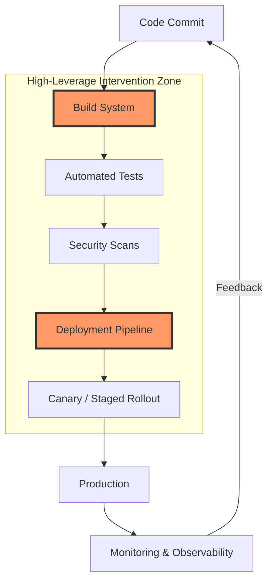
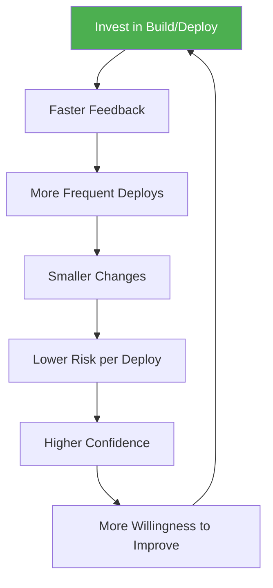

Here's a diagnostic question: does this improvement multiply across every engineer and every deployment?

Most things you could invest in don't pass that test. A new feature helps one product. A refactor helps one service. A training program helps the people who attend. These are worth doing, but they're not leverage.

Build and deployment systems pass the test. Every engineer, every commit, every deploy. And they do something unusual in [[leverage-points-in-software-engineering|Meadows' framework]] — they don't sit at one leverage level. They span five simultaneously.

## Five levels at once

Level 9: they control delay length. A build that takes 45 minutes vs. 5 minutes changes developer behavior. It determines whether engineers batch changes or ship incrementally, whether they run tests locally or trust CI, whether they deploy daily or weekly. The delay length reshapes the entire development rhythm. DORA calls this "lead time for changes" — and it's dominated by build time and deployment automation.

Level 8: they are a negative feedback loop. CI/CD is the primary mechanism for catching defects before production. The speed of this loop directly determines code quality. Minutes create a tight loop. Hours create a weak one. DORA measures the consequence as "change failure rate" — the percentage of deploys that cause failures, determined almost entirely by the quality of automated testing in the pipeline.

Level 6: they structure information flow. Build systems determine what developers learn about their changes — test results, security scans, performance regressions, dependency vulnerabilities. This shapes every decision downstream.

Level 5: they encode the rules. Deploy gates, required approvals, automated compliance checks, canary analysis. These are the rules of the system, encoded in the pipeline. Changing the pipeline changes the rules for every engineer at once.

Level 4: they enable self-organization. A well-designed build system lets teams independently create, test, and deploy services. A poorly designed one forces centralized coordination. DORA measures the outcome as "deployment frequency" — whether teams can deploy on-demand or must batch releases.

Few things in an engineering org touch this many leverage levels at once. The research from Forsgren, Humble, and Kim (published in "Accelerate") confirms the connection — elite-performing teams deploy on-demand, have lead times under one hour, change failure rates under 5%, and restore service in under one hour. Every one of those outcomes is constrained by the pipeline.

## Where to intervene

Within the build system, start with the intervention that's most visible and easiest to justify — then use the political capital to fund the less visible ones.

Build speed comes first. Every minute removed from the build, multiplied by every developer, multiplied by every build per day. A 10-minute improvement for 100 developers running 5 builds/day saves roughly 83 developer-hours per day. This is the easiest win to measure and the easiest to sell.

Then test selection. Running only the tests affected by a change can reduce test suite execution by 80-90% while maintaining the same defect detection rate. High ROI, but requires tooling most orgs don't have out of the box.

Then pipeline-as-code defaults. When the default template includes security scanning, performance testing, and compliance checks, every new service gets these for free. Teams get quality without opting in. This is where leverage compounds hardest — you're encoding best practices into the path of least resistance.

## The compounding effect

The reason build systems are such powerful leverage points is compounding. Improvements multiply across three dimensions:

People — every engineer benefits from every pipeline improvement.
Time — the improvement pays dividends on every future deployment.
Quality — better pipelines enable more frequent, smaller deployments, which are safer, which builds confidence, which enables even more frequent deployment.

That's a positive feedback loop — Meadows' level 7. Investment in the build system accelerates the rate of all other improvements. Under-investment does the opposite. It creates a drag that slows everything else down.

## The failure mode

This argument has a limit. Sometimes orgs over-invest in build infrastructure as a way to avoid harder decisions — cultural change, product direction, team structure. Polishing the pipeline becomes a comfort zone. If your builds are already fast and your deploys are already safe, further investment isn't leverage. It's gold-plating. The diagnostic question still applies: is this multiplying across every engineer and every deployment, or is it optimizing something that's already good enough?

## Why nobody invests

Most organizations under-invest in build and deploy infrastructure for a simple reason: the benefits are diffuse. They spread across all teams rather than concentrating in one visible product. The team that owns the build system can't point to a revenue number. The teams that benefit from it don't attribute their velocity to the pipeline — they attribute it to their own engineering. The improvement is real but invisible, which means it loses every prioritization fight against a feature with a customer name attached.

The leverage trap: the highest-leverage investments are the hardest to get funded, precisely because their impact is spread across everyone.

## The one-liner

The build pipeline is the most underleveraged system in most engineering organizations — because its benefits are spread across everyone, nobody owns the case for improving it.
