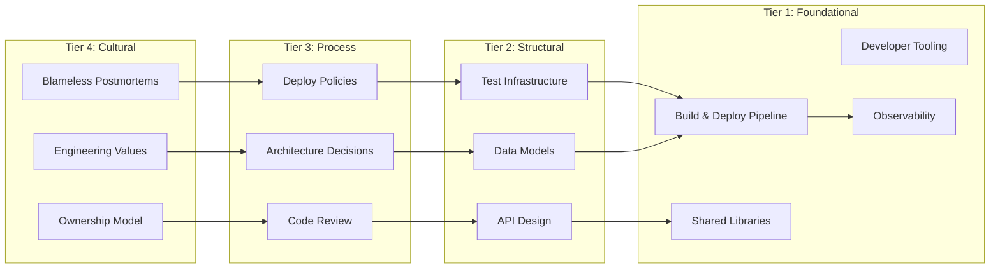

Most engineering improvement efforts target the wrong level. Reorg the teams. Adjust the sprint length. Tune the autoscaler. Add headcount. These feel productive. They produce marginal returns.

The problem isn't effort. It's aim. You're pushing on the system in places where the system barely responds.

Donella Meadows figured out why in 1999.

## The framework

Meadows was a systems scientist who studied where interventions actually work. Her paper "[Leverage Points: Places to Intervene in a System](https://en.wikipedia.org/wiki/Twelve_leverage_points)" ranks twelve places you can push on a complex system, from least to most effective.

The ranking is counterintuitive. The interventions that feel most concrete (change a number, adjust a parameter) are the weakest. The interventions that feel most abstract (change the goal, shift the paradigm) are the strongest.

Here's her framework mapped to software engineering:

| # | Meadows' Leverage Point | Software Analog | Leverage |
|---|---|---|---|
| 12 | Constants, parameters, numbers | Tuning configs, adjusting timeouts, changing team size | Lowest |
| 11 | Size of buffers and stocks | Queue sizes, WIP limits, sprint capacity | ↓ |
| 10 | Structure of stocks and flows | Repo structure, service topology, network architecture | ↓ |
| 9 | Length of delays | Build times, deploy lead times, feedback loop duration | ↓ |
| 8 | Strength of negative feedback loops | Monitoring, alerting, automated rollbacks, code review | ↓ |
| 7 | Gain around positive feedback loops | Tech debt accumulation, "success disaster" scaling | ↓ |
| 6 | Structure of information flows | Observability, dashboards, deploy visibility, error reporting | ↓ |
| 5 | Rules of the system | Coding standards, merge policies, deploy gates, compliance | ↓ |
| 4 | Power to self-organize | Team autonomy, ability to create new tools and abstractions | ↓ |
| 3 | Goal of the system | What the org optimizes for: velocity? reliability? cost? | ↓ |
| 2 | Mindset / paradigm | "Move fast and break things" vs. "you build it, you run it" | ↓ |
| 1 | Power to transcend paradigms | Ability to question and shift fundamental assumptions | Highest |

Most engineering organizations live at levels 10-12. That's where the proposals are easy to write and the results are easy to measure. It's also where the system absorbs your effort and barely moves.

The interesting stuff happens at levels 4-9.

## Where the levers live

Not all leverage points are the same kind of thing. Here's a taxonomy organized by what they affect:

Tier 1 (foundational) affects everything downstream. The build pipeline, developer tooling, shared libraries, and observability platform. Every engineer touches these every day. Improvements here multiply across the entire org. In Meadows' framework, these operate at levels 6-9 — they control delays, structure information flows, and form the negative feedback loops that catch problems early.

Tier 2 (structural) shapes how work gets done. API design and service boundaries determine whether teams can evolve independently. Data models determine whether the system can adapt. Test infrastructure determines how much testing actually happens — not how much you wish happened. These map to Meadows' levels 5-8 — they encode rules, strengthen feedback loops, and define the structure through which work flows.

Tier 3 (process) shapes decisions. Code review is the primary mechanism for knowledge transfer. Architecture decision records prevent repeated mistakes. Deploy policies encode risk tolerance. These are Meadows' level 5 (rules of the system) — the explicit policies that govern how engineers interact with the codebase and each other.

Tier 4 (cultural) shapes thinking. "You build it, you run it" connects cause and effect. Blameless postmortems turn failures into systemic improvements. Engineering values guide tradeoff decisions when nobody's watching. These map to Meadows' levels 2-3 — the paradigms and goals that determine what the organization optimizes for. The highest leverage, and the hardest to change.

The tiers aren't independent. Cultural leverage flows down through process and structure into the foundational systems. An ownership culture without good deploy tooling creates frustration. Good deploy tooling without an ownership culture creates shelfware.

Notice the inversion: the tier numbering runs opposite to Meadows' leverage ranking. Tier 1 (foundational) maps to Meadows' mid-range levels (6-9). Tier 4 (cultural) maps to the highest-leverage levels (2-3). The upstream tiers — culture and process — are more powerful levers in Meadows' framework because they shape the goals and paradigms that everything else follows. Changing a deploy policy (Tier 3, level 5) is more effective than speeding up a build (Tier 1, level 9), even though the build improvement is easier to measure.

This explains a pattern most engineering leaders have seen: organizations that invest heavily in foundational tooling but neglect culture and process get diminishing returns. The tools are good, but nobody uses them well. The highest-leverage move is often upstream — change what the org optimizes for, and the foundational investments start compounding.

Will Larson's quality staircase in "Staff Engineer" maps to a similar range — his "leverage points" tier (interfaces that hide complexity, data models that support evolution) corresponds roughly to Meadows' levels 5-8, the structural and rule-based interventions that compound without requiring total organizational alignment.

## Where orgs get the levels wrong

The Meadows mapping isn't just descriptive. It's diagnostic. Here are three patterns where engineering organizations consistently misapply effort:

**Reorgs instead of tooling.** An org is shipping too slowly. Leadership restructures the teams — new reporting lines, new team boundaries, new names. This is a level 10 intervention (structure of stocks and flows). Six months later, velocity hasn't changed because the actual bottleneck was a 40-minute build (level 9) and a deployment process that required three manual approvals (level 5). The reorg moved boxes on a chart. The build time and deploy gates moved code to production.

**Headcount instead of feedback loops.** A team is drowning in production incidents. The response: hire more engineers. This is level 12 (changing a number). The actual problem is that the monitoring system doesn't surface errors until customers report them (weak level 8 feedback loop) and there's no automated rollback (missing level 5 rule). Two more engineers absorb the same volume of incidents slightly faster. Better observability and auto-rollback prevent the incidents from happening.

**Great tools, no culture to use them.** An org builds a state-of-the-art CI/CD platform. Progressive rollouts, canary analysis, one-click deploys. Adoption is low. Teams still batch releases and deploy weekly. The tooling is tier 1 (foundational, levels 6-9), but the org never changed the tier 4 lever — the cultural paradigm. Engineers are still evaluated on feature delivery, not deployment health. Nobody's incentivized to deploy frequently. The tool works. The system around it doesn't.

Each of these is the same mistake: pushing on a lower-leverage level when a higher-leverage level is the actual constraint. The Meadows framework makes the mismatch visible.

## The diagnostic question

When evaluating where to invest engineering effort, one question cuts through the noise: does this improvement multiply across every engineer and every deployment?

If yes, it's probably a leverage point. If it only helps one team or one project, it might still be worth doing — but it's not leverage.

In my [[til-leverage-hierarchy-for-engineering|leverage hierarchy]], I argued that your impact as an engineer scales with how many people benefit from your work without you being in the room. Meadows' framework explains *why* — it's not just about reach, it's about which level of the system you're pushing on.

Next: [[build-systems-as-leverage|why build and deployment systems are the most undervalued lever in most engineering orgs]] — and what to do about it.

## The one-liner

Most engineering improvement efforts fail not from lack of effort, but from pushing on the system at levels where it barely responds.
