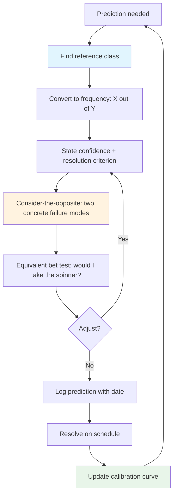

A week ago I wrote about [[manufacturing-feedback-loops-for-long-horizon-judgment|long-horizon judgment as a feedback-loop problem]]. The argument was that engineering intuition does not transfer to multi-year technology bets because the feedback loop never closes.

I re-read the post this week and tried to test it on myself. I asked: when was I last confidently wrong on a multi-year technology bet?

The first thing that happened was I could not think of one. Which, given the argument of the previous post, is exactly what you would expect. Without a log, you do not remember the misses. You rationalize them into the story where you were mostly right.

The second thing that happened, after sitting with it, was that I did remember one. Until mid-2024, I was about 70% confident that LLMs were only as good as autocomplete and could not do real reasoning. I held that belief because the models I had tried genuinely were not good at reasoning. Claude 3.5 Sonnet came out in June. I tried it. The belief did not survive the week.

The interesting part is not that I was wrong. The interesting part is that I can now name the mechanism. I was reasoning from the inside view — the evidence I had was the models I had tried, and those models were not good. The outside view I did not take would have said: current models are one point on a capability curve that has been moving fast for a decade. That gap between the inside view and the outside view is where the miscalibration lived, and it has a specific cognitive shape.

The feedback-loops post was about why the loop is missing. This post is about what is running inside the loop when it is missing — the mechanics that make confident calls feel earned even when they are not, and the specific practices that help.

## The three overconfidences

It helps to start by pulling "overconfidence" apart. [Moore and Healy (2008)](https://en.wikipedia.org/wiki/Overconfidence_effect) showed it is not one phenomenon but three independent ones:

- **Overestimation** — thinking your performance is better than it actually is.
- **Overprecision** — being too certain your beliefs are correct. Classic finding: 90% confidence intervals contain the true answer only about half the time.
- **Overplacement** — thinking you are better than others. Svenson's 1981 study found 93% of American drivers rated themselves above the median.

For engineering forecasting, overprecision is the one that matters. It is the gap between how certain you feel and how accurate you are. The confidence interval you would put around "this platform choice will still be relevant in three years" is almost certainly too narrow, and you cannot feel it being too narrow from the inside.

The foundational calibration research — [Lichtenstein, Fischhoff and Phillips in the 1970s](https://en.wikipedia.org/wiki/Calibrated_probability_assessment) — established a few findings that keep replicating:

- When people say they are 100% certain, they are wrong about 20% of the time.
- 90% confidence intervals capture the true value 50 to 60% of the time.
- Overconfidence is worst on hard, unfamiliar questions. On very easy questions the effect reverses and people become slightly underconfident.

That last point is the hard-easy effect, and it is where engineering forecasting lives. Architecture decisions, framework bets, and platform direction calls are hard questions on high-uncertainty topics. This is the exact region where the miscalibration gap is at its largest.

## Why the brain is bad at probabilities

Kahneman's dual-process framework gives the mechanism. System 1 is fast, associative, and always on. System 2 is slow, rule-based, and lazy. For probabilistic reasoning, the problem is that System 1 generates a confidence feeling before System 2 has a chance to check it.

You read a design doc. The narrative is coherent. The diagrams line up. The author has covered the obvious risks. A feeling of "this will work" arrives in less than a second. By the time you could deliberately consider base rates, failure modes, or comparable projects that looked this clean on paper, the confidence is already formed. Anything System 2 does now is fighting against an anchor you did not choose.

Kahneman's shorthand for this is WYSIATI — "what you see is all there is." System 1 builds the best possible story from whatever information is in front of it and generates confidence based on how coherent the story is, not on how complete the evidence is. The things the design doc does not mention — the failure modes, the scaling cliffs, the second-order effects — do not reduce your confidence because they are not in the story.

Oskamp (1965) demonstrated this cleanly: clinical psychologists given more case details became more confident, but not more accurate. The information did not change the answer. It just made the answer feel more solid.

## The three substitute questions

When System 1 is asked a hard probability question, it does not do probability. It swaps in an easier question. [Tversky and Kahneman (1974)](https://en.wikipedia.org/wiki/Overconfidence_effect) identified three of these substitutions, each producing a predictable distortion.

**Representativeness.** "How probable is X?" gets swapped for "how similar is X to the prototype?" This is the mechanism behind the LLM miscalibration from the opener. Asked "how capable will LLMs be in two years," I substituted "how similar is this to previous AI waves that overpromised and underdelivered?" The answer to the substitute question was "very similar," which produced confident dismissal. The answer to the actual question required a capability trajectory I never plotted.

**Availability.** "How probable is X?" gets swapped for "how easily do examples come to mind?" The examples that came to mind for me were the models I had personally tried. Those models were not good at reasoning. The judgment "LLMs cannot reason" felt evidence-based because the evidence was vivid and recent. The evidence I did not have — frontier models I had not tried, the trajectory from GPT-2 to GPT-3 to GPT-3.5 plotted on a curve — did not enter the estimate, because unavailable evidence does not register as uncertainty. It registers as nothing.

**Anchoring.** The first estimate in a planning meeting becomes a magnet. "I think this will take three weeks" — every subsequent estimate clusters around three weeks, regardless of whether three weeks has anything to do with the actual complexity. Adjustment from the anchor is consistently insufficient.

The fourth and most important is base rate neglect, and it deserves its own treatment.

## The base rate that nobody consults

The [Good Judgment Project's work on forecasting training](https://www.sas.upenn.edu/~baron/journal/16/16511/jdm16511.html) — run by Chang, Chen, Mellers and Tetlock across a four-year IARPA tournament — identified which debiasing principles actually improve forecasting accuracy. The answer, across every year of the study: comparison classes. Base rates. The outside view.

Back to the LLM story. In 2023, the question I was implicitly answering was "will LLMs turn out to be useful for reasoning." The inside-view answer was no, because the models I had tried were not good at it. The outside-view question I never asked was: across the history of machine learning, how often has "this subfield is hitting a wall" turned out to be true on a two-to-three-year horizon? The honest answer is that the wall calls have a poor track record. Speech recognition, image classification, translation, game-playing — each of those generated confident "this is as good as it gets" predictions from credible people, each of those predictions was wrong on a similar timescale, and the pattern was visible in the literature if anyone had bothered to check.

I did not bother to check. The inside view was vivid and the outside view required effort, and System 1 does not spend effort it does not have to.

The engineering translation is straightforward and uncomfortable. When you are reviewing a platform migration plan, the question is not "will this one succeed" in isolation. The question is "what fraction of migrations of similar scope, at similar organizations, with similar team composition, finished on time and delivered the promised benefits?" That base rate is almost always lower than the confidence the room is projecting.

Most engineering estimation fails at this step. The room looks at the specific plan, the specific team, the specific architecture, and reasons from the inside out. Nobody turns around and asks what happened to the last ten projects that looked like this one.

## A note on expertise

The [[manufacturing-feedback-loops-for-long-horizon-judgment|feedback-loops post]] covered why experienced engineers are not automatically better at this. Short version: Kahneman and Klein's ["Conditions for Intuitive Expertise"](https://journals.sagepub.com/doi/10.1037/a0016755) argues trustworthy intuition requires a high-validity environment plus fast feedback. Debugging meets both conditions. Multi-year technology forecasting meets neither. The intuition earned in one domain does not transfer to the other, but the confidence carries over identically from the inside. Read that post for the full argument.

The only piece worth pulling forward is the implication for this post: when a senior engineer feels very certain about a technology bet, the feeling is downstream of pattern-matching in a domain where the patterns do not actually hold. Base rate neglect, representativeness, and WYSIATI are all running unchecked, and the debugging-honed confidence signal is not a reliable warning system.

## What actually trains calibration

The research has a consistent answer on what moves the needle. It is not reading about biases. [Croskerry (2003)](https://en.wikipedia.org/wiki/Overconfidence_effect) and the Good Judgment Project researchers converge on four categories of debiasing, in roughly increasing order of effectiveness:

1. **Information-based.** Tell people about biases. Least effective. Knowing about overconfidence does not cure it. The biases are running in System 1 and do not respond to System 2 awareness.
2. **Process-based.** Teach specific procedures — consider-the-opposite, reference-class forecasting, pre-mortems. More effective because they give you something concrete to do, not just something to be aware of.
3. **Feedback-based.** Provide trial-by-trial calibration data. You made this prediction at 80%. You have made 40 predictions at 80%. 62% of them have resolved correctly. You are systematically overconfident at the 80% level. This is the intervention that actually changes behavior.
4. **Format-based.** Restructure how information is presented. Gigerenzer's finding that [natural frequencies beat probabilities](https://pmc.ncbi.nlm.nih.gov/articles/PMC4604268/) sits here. "9 out of 1000" is cognitively tractable in a way "0.9%" is not.

The order matters. If you only do the first, you have read a book about calibration and nothing in your actual judgment has changed. If you layer all four, measurable calibration improvement shows up in as little as an hour of training, and it transfers to the practitioner's actual domain.

## The practical translation

Here is what I am trying to build into my own practice. None of this is original — it is just the mechanical application of the techniques above.

**Find the base rate before you form the estimate.** This is the single highest-leverage move. Before writing "I think this migration will take six months," find the five most similar migrations you know about and write down how long they actually took. Let the base rate be the anchor instead of your gut.

**Think in frequencies, not percentages.** "Three out of ten similar projects delivered on time" is a different mental object than "30% probability of on-time delivery." The first one activates comparison reasoning. The second one activates vibes.

**Use the equivalent bet test.** Douglas Hubbard's technique from [*How to Measure Anything*](https://hubbardresearch.com/calibration-training/): when you say "I am 90% confident," pause and imagine being offered a choice between a bet that pays out if your prediction is right and a bet that pays out if a spinner lands in a 90% zone. Which do you actually prefer? If you would take the spinner, your confidence is too high. This is a surprisingly reliable way to catch overprecision that abstract reasoning misses.

**Force a consider-the-opposite pass.** Before finalizing a prediction, write down two specific reasons it could be wrong. Not "things could go wrong" in the abstract. Actual, specific failure scenarios. This is the cheapest process-based debias available.

**Log dated predictions with probabilities and resolution criteria.** This is the intervention the [[manufacturing-feedback-loops-for-long-horizon-judgment|feedback-loops post]] argued for, and it is the one that activates everything above. Without a log, you never get the trial-by-trial feedback that actually moves calibration. The techniques in this section are what you do *inside* each prediction. The log is what lets you learn across them.

## What I am not claiming

I want to be careful about what the research actually supports. A few things it does not:

It does not say that senior engineers are bad at their jobs. The intuition honed on high-validity tasks is real and trustworthy within its domain. The claim is narrower: that intuition does not transfer to a specific class of low-validity tasks, and the confidence feels the same in both domains.

It does not say that calibration training makes you a superforecaster. The Good Judgment Project's under-an-hour training produced improvements in the 6 to 12% range across four years of their tournament. That is meaningful but not transformative. The real gains come from combining training with sustained practice and feedback over months, not hours.

It does not say that every technical decision should be gated on a formal prediction. That would be paralysis. The argument is that for decisions with multi-year consequences — platform choices, architectural invariants, team-scaling bets — the cost of a ten-minute reference-class check is trivially low compared to the cost of being wrong.

## The one-liner

When I sat down to remember a time I had been confidently wrong on a multi-year technology bet, the first thing that happened was I could not think of one. That blank was not the absence of misses. It was the absence of a log. The mechanics in this post are how individual predictions get better. The log is how you find out you were wrong in the first place.
