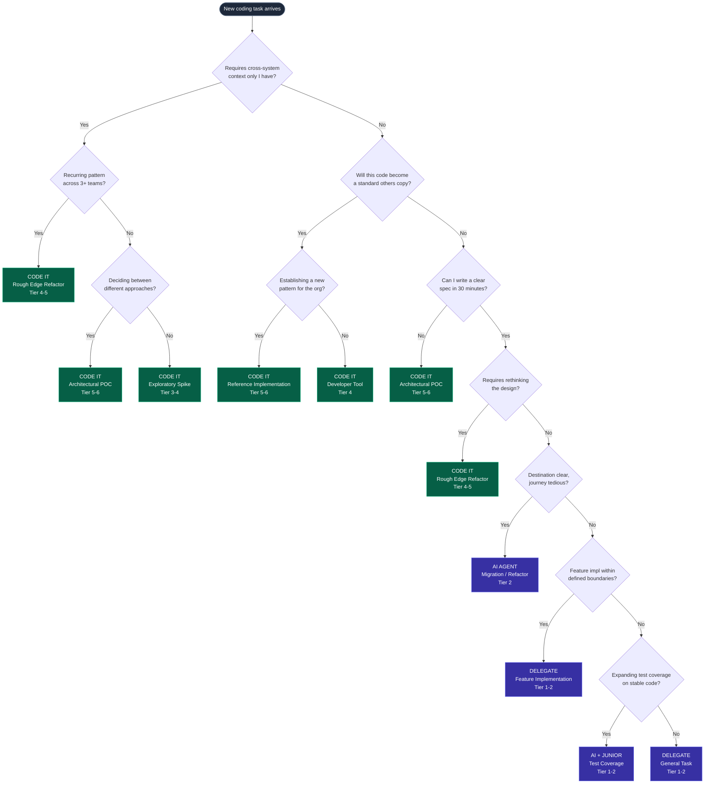

Last month I found myself three days deep into implementing a data validation framework. The code was clean, the tests were passing, and I was genuinely enjoying the work. Then my manager asked a simple question: "Why are you writing this instead of having someone else do it?"

I didn't have a good answer.

The honest truth was that I *wanted* to write it. I knew I'd do it well. But "I'll do it well" isn't a PE-level justification for spending three days on implementation work. A senior engineer could have done it in a week with my guidance, learned something in the process, and freed me to work on the cross-org architecture problems that only I could see.

This interaction forced me to confront a question I'd been avoiding: in a world where AI can generate decent code in seconds and junior engineers are increasingly AI-augmented, what coding work should a principal engineer actually do themselves?

The old heuristics don't work anymore. "Stay technical" is too vague. "Don't be a bottleneck" doesn't tell you what to pick up. "Work through others" assumes the work is delegatable in the first place.

I spent the next few weeks building a decision framework for myself — a way to quickly assess any coding task and decide whether to do it, delegate it, or hand it to an AI agent. This post shares that framework.

---

## The Core Principle

Write code where the **judgment-to-keystroke ratio** is highest. If 80% of the value is in the keystrokes (implementation), delegate or use AI. If 80% of the value is in the *decisions embedded in the code* (architecture, abstractions, data models), write it yourself — and use AI to accelerate the execution.

---

## The Quick Decision Test

For any coding task, ask these three questions in order:

1. **Does this require cross-system context that only I have?** → Code it yourself
2. **Will this code become a standard others copy?** → Code it yourself
3. **Could I write a clear spec for this in 30 minutes?** → Delegate it

---

## Decision Flowchart

> Green nodes = **code it yourself**. Purple nodes = **delegate or AI agent**.

## Leverage Tier Map

| Tier | Who executes | Work types |
|------|--------------|------------|
| **Tier 5–6: You hand-craft** | PE writes the code | Arch POCs, reference impls, cross-system refactors, data models, interfaces |
| **Tier 3–4: You + AI accelerates** | PE directs, AI implements | Dev tools, exploratory spikes, process automation |
| **Tier 1–2: Delegate or AI agent** | Junior + AI, or AI solo | Feature impl, bug fixes, test backfill, migrations, docs |

---

## Part 1: The Decision Matrix

### CODE IT YOURSELF

#### 1. Architectural Proof-of-Concepts

- **Signal:** You're deciding between fundamentally different approaches
- **Why you:** The decisions embedded in the code — abstractions, boundaries, data models — are pure judgment. A junior or AI will make subtly wrong trade-offs that cascade for years.
- **AI's role:** Use AI to accelerate implementation once you've decided the approach. Write the interfaces yourself, let AI fill in the body.
- **Litmus test:** Will this code become a de facto standard that others copy?
- **Leverage tier:** Tier 5–6 (Platform + Paradigm)

#### 2. Cross-System Rough Edge Refactors

- **Signal:** You've seen the same class of bug across 3+ teams
- **Why you:** Only someone with cross-org visibility can recognize the pattern. The fix is usually small (100–500 lines) but requires understanding how multiple teams misuse an abstraction.
- **AI's role:** Have AI draft the implementation after you define the target interface. You own the abstraction design; AI handles the mechanical refactoring.
- **Litmus test:** Would this require 3+ design review meetings to explain if written by someone else?
- **Leverage tier:** Tier 4–5 (Systems + Platform)

#### 3. Reference Implementations

- **Signal:** You're establishing a new pattern for the org
- **Why you:** The code IS the technical strategy. Other teams will copy it, adapt it, and propagate your architectural decisions. It needs to be exemplary.
- **AI's role:** Use AI to generate comprehensive tests and documentation for your reference implementation. The code teaches; AI helps make it teach well.
- **Litmus test:** If I open-sourced this, would it define how people approach this problem?
- **Leverage tier:** Tier 5–6 (Platform + Paradigm)

#### 4. Developer Tools That Multiply Your Team

- **Signal:** You see a repetitive task consuming >5 hours/week across the team
- **Why you:** This is where AI gives you the biggest personal leverage boost. You can now ship in a day what would have taken a sprint — and your version has the right abstractions baked in.
- **AI's role:** This is your AI power zone. Let Claude Code/Cursor handle 80% of implementation. You provide the UX design and architectural skeleton.
- **Litmus test:** Would building this take me 2 hours with AI but save the team 200 hours/quarter?
- **Leverage tier:** Tier 4 (Systems)

#### 5. Exploratory Analysis & Spikes

- **Signal:** The team needs data to make a decision, not just opinions
- **Why you:** A PE running a quick data analysis or spike provides a level of insight no delegation can match — you know what questions to ask the data.
- **AI's role:** AI is exceptional here — use it to write data extraction scripts, generate visualizations, and iterate on analysis. You interpret; AI computes.
- **Litmus test:** Am I the only person who would know which questions to ask?
- **Leverage tier:** Tier 3–4 (Delegation + Systems)

---

### DELEGATE (or use AI as the implementer)

#### 6. Feature Implementation Within Defined Boundaries

- **Signal:** The architecture is decided; this is execution
- **Why delegate:** Once you've set the direction, implementation is a growth opportunity for others. Your involvement becomes a bottleneck, not a multiplier.
- **AI's role:** Junior + AI is the new execution unit. Define the spec clearly, have them use AI to accelerate, and review the output.
- **Litmus test:** Could I write a clear spec that a competent SDE II could execute?
- **Leverage tier:** Tier 1–2 (Labor + Tools)

#### 7. Test Coverage Expansion

- **Signal:** The system is stable; we need more safety nets
- **Why delegate:** Writing tests for existing stable code is high-volume, moderate-judgment work. AI excels at generating test cases; juniors learn the system by testing it.
- **AI's role:** AI can generate 80%+ of test code from existing implementations. Have a junior review and refine. You review coverage gaps only.
- **Litmus test:** Is the hard part knowing *what* to test, or *writing* the tests?
- **Leverage tier:** Tier 1–2 (Labor + Tools)

#### 8. Bug Fixes (Non-Architectural)

- **Signal:** The fix doesn't require rethinking the design
- **Why delegate:** Unless the bug reveals a systemic design flaw, debugging is a learning opportunity for others. Your time is better spent on the design flaw if one exists.
- **AI's role:** AI is excellent at targeted debugging. Point it at the failing test, let it propose fixes, have a team member validate.
- **Litmus test:** Does fixing this bug change how I think about the system?
- **Leverage tier:** Tier 1 (Labor)

#### 9. Migrations & Mechanical Refactors

- **Signal:** The destination is clear; the journey is tedious
- **Why delegate:** Large-scale codemod-style changes are the definition of high-volume, low-judgment work. AI agents can now handle multi-file refactors with supervision.
- **AI's role:** This is AI's sweet spot. Use Claude Code or Codex for multi-file mechanical changes. You define the transformation rules; AI executes across the codebase.
- **Litmus test:** Could I describe this as a set of deterministic transformation rules?
- **Leverage tier:** Tier 2 (Tools)

#### 10. Documentation & Runbooks

- **Signal:** Knowledge exists in your head; it needs to be externalized
- **Why delegate:** While you should write initial architecture docs yourself (that's media leverage), detailed runbooks and API docs can be drafted by AI and refined by the team.
- **AI's role:** AI generates excellent first drafts from code. Have it analyze your codebase and produce docs. You review for accuracy and add the "why" that code can't express.
- **Litmus test:** Is the value in the knowledge or in the writing?
- **Leverage tier:** Tier 2–3 (Tools + Delegation)

---

## Part 2: The AI-Amplified PE Workflow

### Phase 1: Spec-First Planning (~30–60 min)

Before touching code, use AI as a brainstorming partner to produce a `spec.md`. Describe the problem, have the AI ask you clarifying questions, then compile requirements, architecture decisions, data models, and a testing strategy.

**PE Advantage:** Your cross-org context means you ask questions the AI wouldn't think of: "How will Team X's migration affect this interface next quarter?"

**Tools:** Claude chat, then save as `spec.md` in your repo

> "Don't just throw wishes at the LLM — begin by defining the problem and planning a solution." — Addy Osmani

### Phase 2: Interface-First Implementation (~1–2 hours)

Write the interfaces, type signatures, and data models yourself. These are your highest-judgment decisions. Then let AI fill in the implementation bodies one function at a time.

**PE Advantage:** Larson's three leverage points — interfaces, stateful systems, data models — are exactly what you should hand-craft. AI fills in everything below the abstraction boundary.

**Tools:** Cursor or Claude Code with your `spec.md` loaded as context

> Break work into iterative chunks. "Implement Step 1 from the plan" → test → "Implement Step 2". Never ask for monolithic outputs.

### Phase 3: Parallel Agent Delegation (variable)

For larger efforts, spawn multiple AI agents on parallel tasks. Agent A handles backend logic, Agent B builds the frontend, Agent C generates tests. You review and integrate.

**PE Advantage:** You're now operating as what Addy Osmani calls an "orchestrator" — managing a team of AI agents the same way you'd manage a team of engineers, but at 10x speed.

**Tools:** Claude Squad, Cursor multi-tab, or Claude Code in separate worktrees

> Each agent gets its own isolated git worktree to avoid conflicts. Review integration points carefully — agents don't know about each other.

### Phase 4: Review as the Accountable Engineer (~20–40% of implementation time)

Every line of AI-generated code gets your review. If something feels wrong, dig in. Ask the AI to explain its reasoning. Rewrite convoluted sections. You merge nothing you don't understand.

**PE Advantage:** "Almost everything that makes someone a senior engineer — designing systems, managing complexity — is what now yields the best outcomes with AI." Your review catches what AI misses. — Simon Willison

**Tools:** Standard code review tooling + AI for explaining unfamiliar patterns

> The danger isn't that the agent fails. It's that it succeeds so confidently in the wrong direction that you stop checking the compass. — Addy Osmani

### Phase 5: Extract, Document, Publish (~30–60 min)

After shipping, extract reusable patterns into shared libraries. Have AI generate documentation. Write a brief internal post about what you built and why. This converts code leverage into media leverage.

**PE Advantage:** This is the flywheel: internal code → reference implementation → internal blog post → external blog post → conference talk. Each step compounds.

**Tools:** AI for docs generation, your blog/wiki for publishing

> The code you wrote in Phase 2 (interfaces and data models) IS the architecture decision record. Generalize and share it.

---

## Part 3: PE Coding Time Budget

| Activity | % of Week | Category |
|----------|-----------|----------|
| Spec writing & AI planning | 10% | Hands-on code |
| Interface/model design (you write) | 15% | Hands-on code |
| AI-accelerated implementation | 15% | Hands-on code |
| Review & integration | 10% | Hands-on code |
| Design reviews & strategy | 25% | Strategy/influence |
| Writing, mentoring, meetings | 25% | Strategy/influence |

**~50% hands-on-code (with AI) + ~50% strategy/influence = the new PE balance**

---

## Part 4: Anti-Patterns to Watch For

### ⚠ The Heroic Implementer

Taking on the biggest, meatiest implementation tasks because you know you'll do them best.

- **Problem:** You become a bottleneck. Context-switching between PE responsibilities and deep implementation means both suffer. The project blocks on your calendar.
- **Signal:** You have 3+ open PRs older than a week.
- **Fix:** If the task would take a junior 2 weeks but you 3 days, delegate it. Those 3 days of your time are worth more on Tier 4–6 work.

### ⚠ The Architecture Astronaut

Writing design docs and attending reviews but never touching code, losing grounding in reality.

- **Problem:** Your technical judgment atrophies. Teams stop trusting your architectural guidance because you haven't felt the pain of implementing it.
- **Signal:** You can't name the top 3 pain points in your team's development workflow.
- **Fix:** Maintain 20–30% hands-on coding time. Use AI to stay in the code without it consuming your entire week.

### ⚠ The AI-Delegator

Using AI to generate everything, including the architectural decisions that should be hand-crafted.

- **Problem:** AI makes plausible-looking but subtly wrong architectural choices. Without your judgment in the interfaces, the system accrues invisible design debt.
- **Signal:** You're accepting AI suggestions for data models and API contracts without significant modification.
- **Fix:** Always hand-craft interfaces, types, and data models. Let AI implement below your abstraction boundary, never above it.

### ⚠ The Perfectionist Reviewer

Spending hours rewriting AI-generated or junior-written code to match your style.

- **Problem:** You've converted delegation into a slower version of doing it yourself. Others don't grow because you rewrite everything.
- **Signal:** Your code reviews regularly include 20+ suggested changes, most stylistic.
- **Fix:** Define coding standards in `CLAUDE.md` / linting rules. Let automation enforce style. Reserve your review energy for architectural issues only.

---

## The Meta-Rule

The old advice — "work through others" — was about not being the bottleneck on *execution*. AI doesn't change this principle; it changes what counts as execution.

In 2026, the execution layer includes AI agents. "Working through others" now means working through **people AND AI agents**. Your job is still the same: apply judgment at the highest leverage tier you can reach, and let everything below that tier be handled by the most efficient executor available — which is increasingly AI for Tier 1–2 work, and junior engineers + AI for Tier 3 work.

**The L8 litmus test:** Before starting any coding task, ask yourself whether the resulting code will influence 100+ ICs across multiple orgs. If yes, it's L8-scope work and you should be deeply involved. If it influences only your immediate team, it's L7-scope and a delegation opportunity.

---

*Framework synthesized from: Will Larson (Staff Engineer, Crafting Engineering Strategy), Tanya Reilly (The Staff Engineer's Path), Addy Osmani (Beyond Vibe Coding, AI-Native Software Engineer), Matt Basta (Doing vs. Delegating), Naval Ravikant (leverage hierarchy), Andy Grove (High Output Management), and DX Research Q4 2025 AI Impact Report.*

---

## The One-Liner

Before you start coding, ask: is the value in the keystrokes or in the judgment? If it's the keystrokes, delegate. If it's the judgment, write it yourself — and use AI to make the keystrokes faster.