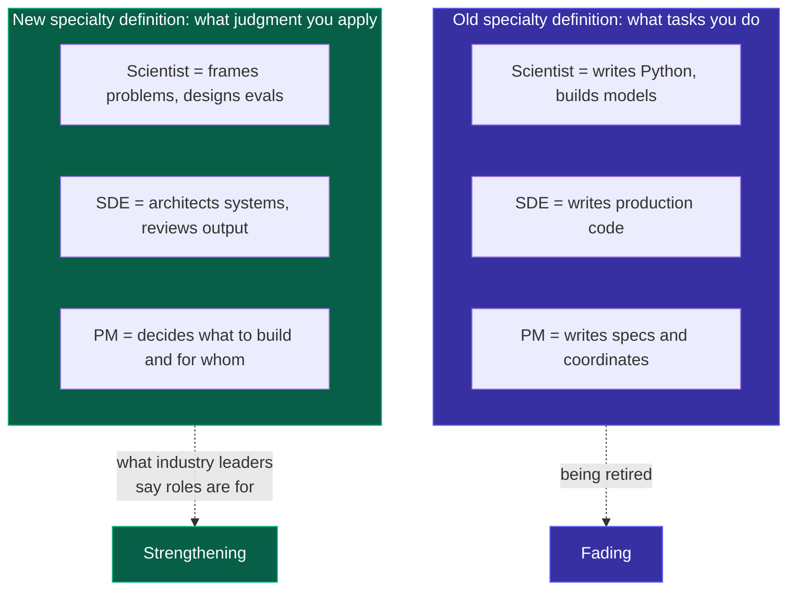
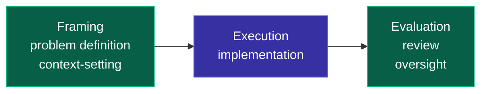

I walked into a 1:1 with my manager last month to pitch a platform. The idea: let scientists build and deploy models to production without depending on engineering teams. I had the architecture, the migration path, the staffing asks. I was ready for pushback on feasibility.

He pushed back on something else. "How do you think teams should operate in an AI world?" It wasn't a rhetorical question. He wanted me to reason about the end state before I committed us to a platform that would lock in a particular shape of how roles interact for the next three years.

I didn't have a good answer. I had an implementation.

This post is the mental model I built to answer his question. It's for anyone making staffing, org design, or platform investment decisions in an environment that's being reshaped by AI, and anyone else who has to decide what "specialization" is even supposed to mean anymore.

## The thesis, up front

Every role (SDE, Scientist, PM, Manager) has two components:

1. **Production** — the task output the role produces. Code, models, specs, status updates.
2. **Judgment** — the decisions the role makes about what to produce and whether what got produced is any good.

AI is commoditizing production across all four roles. Judgment stays human. Roles are being redefined around what judgment the role uniquely contributes.

This has a sharp consequence. "Specialization" has two definitions:

- The **old definition** is task-based. A scientist is someone who writes Python and builds models. An SDE is someone who writes production code. A PM is someone who writes specs.
- The **new definition** is judgment-based. A scientist is someone who frames problems and designs evaluations. An SDE is someone who architects systems and reviews output. A PM is someone who decides what to build and for whom.

The two definitions recommend opposite org designs. The old definition wants handoff-heavy structures that keep each role inside its task lane. The new definition wants platform-enabled structures that free specialists from production work so they can spend more time on judgment.

Most objections I hear to AI-era role redefinition, including the objections I encounter when pitching platforms, are defenses of the old definition, dressed up as concern for the new one. That's the claim the rest of this post is trying to earn.

## What's shifting per role

All four roles are moving from execution to judgment. Same pattern, different specifics.

| Role | Old value (execution) | New value (judgment) |
|---|---|---|
| SDE | Implementing specs in working code | Decomposing problems for AI agents, reviewing output, catching what AI gets wrong |
| Scientist | Building and training models | Framing problems, designing evaluations, interpreting results |
| PM | Translating business needs into specs and coordinating with engineering | Prototyping directly, orchestrating agents, deciding what to build and for whom |
| Manager | Tracking work, running status meetings, coordinating handoffs | Designing oversight architecture, running feedback cycles, deciding at higher span |

A few supporting points worth pulling out of the table.

**SDE.** The 55% faster task completion number from [GitHub's controlled Copilot study](https://github.blog/news-insights/research/research-quantifying-github-copilots-impact-on-developer-productivity-and-happiness/) is widely cited. The number matters less than the implication: if the same work takes half the time at the keyboard, the engineer's value shifts to what happens before and after the keyboard. Andrej Karpathy's framing from his [Software 3.0 talk](https://karpathy.ai/) is the one I keep coming back to: "You are not writing the code directly 99% of the time. You are orchestrating agents who do and acting as oversight." Reading code is harder than writing it. The reviewer role is harder, not easier, than the writer role.

**Scientist.** The common framing "SDEs are about coding, scientists are all about algorithms" is already wrong and getting wronger. USDSI puts it plainly: the data scientist role is shifting "from manual data processors to model builders to strategic orchestrators and architects of AI systems" ([source](https://www.usdsi.org/data-science-insights/the-role-of-agentic-ai-in-redefining-data-science-careers)). Writing Python by hand is table stakes, not specialty. What stays scientist-specific is the judgment about what to model, whether the model works, and what the results mean.

**PM.** The role boundary between PM and SDE is dissolving on the execution side, even if it stays intact on the judgment side. Stephan Schmidt's [Product Engineer framing](https://www.amazingcto.com/product-engineer/) captures the direction: product and engineering are merging into a single role that prototypes, ships, and iterates directly with customers. Drew Breunig makes a similar observation about hybrid engineer-PMs building directly. What to build and for whom is still a product decision. But the handoff from "deciding" to "building" is collapsing.

**Manager.** Gallup's span-of-control numbers moved from 10.9 direct reports in 2024 to 12.1 in 2025. Practitioners working with AI-augmented teams are recommending spans of 15-20. The tools that used to absorb a manager's week (status tracking, meeting notes, follow-ups) are being automated. Gartner's projection is that by 2027, 70% of engineering leader role descriptions will require oversight of generative AI, up from less than 40% today.

## The cross-role pattern

Three things repeat across all four roles.

### 1. The unit of work shrinks

A scientist who used to build a model over weeks now iterates over hours. An engineer who used to write a function over a day now reviews ten AI-generated drafts in the same time. PMs who used to write a spec over a week now prototype. The cost of "one attempt" drops to near zero, which means the optimal number of attempts goes up. Every role is operating at higher iteration frequency.

### 2. The value-producing step moves to the edges

Quality is decided earlier (in framing, prompting, context-setting) and later (in evaluation, review, oversight). The middle of the pipeline, implementation, is where AI takes over.

Green is where human judgment has high value. Purple is where AI does most of the work. The barbell gets more extreme over time, which means the skills that matter most live at the two ends, not in the middle.

### 3. The handoff boundary becomes a liability

If execution is cheap, the most expensive thing a team does is move a problem across role boundaries. Teams that let roles collapse handoffs (PMs prototype, scientists deploy, engineers build platforms) ship faster than teams that maintain strict role boundaries.

This is the part that breaks most org charts. The org chart encodes handoffs. If handoffs are the bottleneck, the org chart is the bottleneck.

## What doesn't change

Four things, to be clear about what the mental model is not claiming.

The nature of specialty judgment doesn't change. A scientist's scientific judgment, an engineer's systems judgment, a PM's customer judgment, a manager's people judgment. These are what the roles are actually for. AI amplifies them; it doesn't replace them.

The need for domain expertise doesn't change. AI agents without good context operate like a new hire producing competent work that ignores established patterns and repeats approaches the team already rejected. The specialist's domain knowledge is what turns AI from generic into valuable. Without context, AI reverts to the mean of its training data, which is usually worse than your team's actual standards.

The need for human accountability doesn't change. Someone has to own the outcome when the AI gets it wrong. Roles are the scaffolding for accountability, and that scaffolding still matters.

The need for taste doesn't change. In fact it matters more. When every role can produce ten drafts instead of one, the bottleneck moves to selection. Selection is taste. Taste is judgment applied to outputs.

## The platform argument

Back to the 1:1 that started this post.

The platform I was proposing is, in the language of this mental model, a bet on the new definition of specialization. If you believe scientists are valuable because they frame problems and design evaluations, you want to free them from the production work (deployment pipelines, service reliability, data plumbing) that consumes their time without using their judgment. A platform does that.

If you believe scientists are valuable because they write Python and build models, a platform makes you nervous, because it lets them touch production, which violates the task boundary. You'd prefer the handoff model, where engineering teams receive model artifacts and deploy them.

Both positions can be stated as "we need to protect scientist specialization." They recommend opposite platforms.

This is what I didn't have a good answer for in the 1:1, and what I have one for now. The platform bet is specifically a bet on the new definition. Staying with the handoff model is specifically a bet on the old one. Neither is neutral.

The honest version of the objection I most often hear is not "specialization is under threat." It's "we're protecting the current workflow, which is built around handoffs, and redefining roles would require redesigning the workflow." That's a real concern. Workflow redesign is expensive. But it should be stated as what it is, a workflow concern, not dressed up as a specialization concern, because those two concerns recommend different responses.

## Questions a leadership team can actually use

If you're leading a team through the AI disruption, three questions worth putting on the table at your next staff meeting:

1. **When someone on your team argues to "protect specialization," which definition do they mean?** If the task-based one, you're looking at a defense of the current workflow, not the specialty. If the judgment-based one, the same person should be advocating hardest for platform investment and handoff reduction, because those are what give specialists more time for judgment work. If their stated concern and their recommended actions don't match, it's worth digging in.
2. **Where on the framing-execution-evaluation barbell is your team currently investing?** Most orgs I've seen are still structured around execution. The shift says to move investment toward framing (better context files, sharper problem definitions, more time upfront) and evaluation (better review practices, sharper quality gates, more oversight infrastructure). If your quarterly goals are all about shipping features, you're still optimizing for the middle of the barbell.
3. **Which handoffs in your team's current workflow are the most expensive?** Every handoff that used to be a boundary is now a candidate to become a bottleneck. The ones to examine first are the ones where the sending and receiving roles both have to rebuild context. That's where role redefinition pays off fastest, and where platform investment has the highest leverage.

## The one-liner

When someone says "protect specialization," ask them which definition they mean. The answer tells you which org design they're actually defending, and whether it's the one you want to be running in three years.
