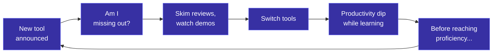

A senior engineer on my team pinged me last week with a question I've been hearing more often: "Should I switch from Cline to Kiro? Or should I try something else? Someone on Twitter said there's a new tool that's better for large codebases."

I asked what problem he was trying to solve. He paused. "I just don't want to fall behind."

That's the anxiety driving most AI tool decisions right now. "What if everyone else is using something I'm not?" FOMO dressed up as technical evaluation.

## The flood

The AI coding assistant space alone has gone from "Copilot and maybe a few others" to dozens of serious contenders in 18 months. And coding assistants are just one category. Documentation, code review, testing, architecture, project management: each has its own crowded field that reshuffles weekly.

The rational response would be to pick one tool, learn it well, and revisit quarterly. The actual response I see is engineers spending hours reading comparison posts, trying three tools in parallel, and using none of them effectively.

## Why more options makes you worse at choosing

This isn't a willpower problem. It's a well-documented cognitive phenomenon.

Barry Schwartz's research on the paradox of choice showed that increasing options beyond a threshold degrades decisions. More anxiety, lower satisfaction, and people frequently choose nothing at all. Sheena Iyengar's jam study found the same thing: 24 jams on display attracted more browsers but fewer buyers than 6.

The AI tool market is a jam display with 200 jars, and someone adds 10 new ones every week while rearranging the shelf.

Engineers get hit especially hard. We're trained to find optimal solutions, and when the option space shifts faster than any evaluation cycle can complete, that instinct becomes a trap. By the time you've finished your comparison spreadsheet, half the entries have shipped major updates. Real evaluation takes a week on your actual codebase, so the cost of trying each tool exceeds any reasonable time budget. People substitute skimming reviews for actually using the thing, then wonder why their choices don't stick. And every time a respected engineer tweets "I switched to X and my productivity doubled," it triggers a wave of re-evaluation across the community, even when the endorsement reflects recency bias or a totally different use case.

## The cost nobody talks about

The hidden cost of tool churn is the context-switching tax, not the subscription fees. Every tool has its own mental model, its own prompting quirks, its own strengths you only discover after a week of use. When you switch, you reset all of that. I've watched engineers spend more time configuring and switching between AI tools than they saved by using them. The net was negative.

This is the tool churn cycle. You never reach proficiency because you never stay long enough. Each switch feels like progress. The aggregate effect is stagnation.

## A framework for cutting through it

I've landed on a decision framework that's worked for me and for engineers I've shared it with.

### 1. Define your bottleneck before you shop

Most engineers start with "what's the best AI tool?" That's the wrong question. The right question is "what's the slowest part of my workflow right now?"

Writing boilerplate? You need autocomplete. Understanding unfamiliar codebases? Codebase-aware chat. Writing tests? Test generation. Context-switching between tasks? You might need fewer meetings, not another tool.

The bottleneck question turns an unbounded shopping problem into a bounded search. You stop evaluating "AI tools" and start evaluating "tools that fix this specific friction."

### 2. Filter ruthlessly, then commit for two weeks

You can't try everything. You shouldn't try to. Once you've named your bottleneck, apply three filters to cut the field down fast:

- **Approved and available.** Does your org actually allow it? This alone eliminates half the list.
- **Solves your specific bottleneck.** Specifically good at the thing you identified in step 1, not just "generally good." A five-minute scan of the docs or a colleague's experience is enough to check this.
- **One recommendation from someone you trust.** Not a Twitter thread. A person on your team or in your network who used the tool on a real project and can tell you what it's actually like.

That should leave you with one or two candidates. Pick one. Use it exclusively for two weeks. No switching. No "just trying" alternatives on the side.

Two weeks matters because the value curve is nonlinear. Days 1 through 3 are frustrating. You're fighting the tool's defaults. Days 4 through 7, you've learned the basics. The second week is where real value shows up: you've internalized the strengths, learned to route around the weaknesses, built prompting habits that actually work.

Most people who say "I tried X and it wasn't that great" used it for three days. They evaluated the tool at its worst and compared it against their old tool at its best.

### 3. Evaluate on your work, not on demos

Demo tasks are misleading. "Build me a todo app" tells you nothing about how a tool handles your 200-file TypeScript monorepo with custom build tooling and three layers of abstraction. The only evaluation that matters is one conducted on your actual codebase, with your actual tasks.

Keep a simple log during your two-week trial. Each day, note one thing the tool did well and one thing it did poorly. At the end, you'll have 14 data points grounded in reality instead of vibes. That's enough to make a real decision.

Herbert Simon called this "satisficing": choosing an option that meets your criteria rather than exhaustively searching for the optimal one. In stable environments, maximizing beats satisficing. In environments that change faster than you can search, satisficing wins by a mile.

## The one-liner

The best AI tool is the one you actually learn to use well. The worst AI tool is the one you switch to next week.
