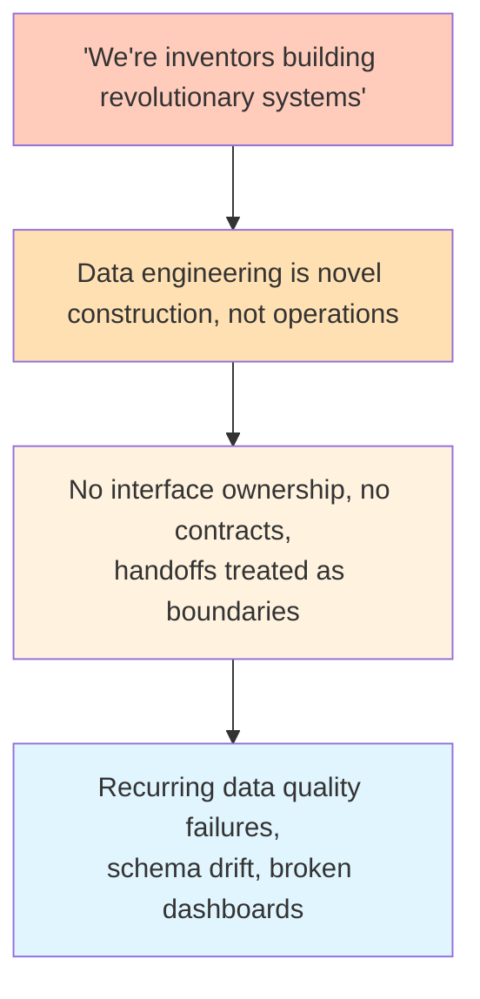

We had a data quality problem. Pipelines would break, downstream consumers would get bad data, someone would file a ticket, an engineer would fix the immediate issue, and everyone would move on. Then it would happen again. Different pipeline, different dataset, same pattern: data handed off between teams arrived malformed, undocumented, or silently changed from what the consumer expected.

We tried the obvious fixes. Added validation checks. Wrote runbooks. Created a shared channel for data quality issues. Built dashboards to catch anomalies earlier. Each fix helped for a while. Each time, the problem came back in a slightly different form.

After the third or fourth cycle of this, I started suspecting we weren't fixing the problem. We were fixing symptoms, and the thing generating the symptoms was still running underneath.

I just didn't know how to name it.

## The headlines

I started by writing down what was actually happening. No interpretation, no root-cause analysis. Just the facts as a journalist would report them.

Downstream consumers regularly received data that didn't match their expectations. Schema changes arrived without warning. Fields that were populated last week were null this week. Definitions of key metrics drifted between teams without anyone noticing until a dashboard broke. We'd fixed variants of this problem at least four times in the past year.

This is what Sohail Inayatullah calls the litany: the surface-level events that show up in tickets and incident reports. If I'd stopped here, the response would be what it had always been. Add another validation check. Send another Slack message. Update another runbook.

I'd been stopping here for a year. The problem kept coming back. So I went deeper.

## The structures

Why did this keep happening? I mapped the machinery.

No formal contract existed between data producers and consumers. Teams published datasets to a shared location, and downstream teams consumed them, but nobody owned the interface between them. There was no schema registry, no versioning policy, no notification mechanism for breaking changes.

The teams producing data were measured on their own project delivery, not on the reliability of what they handed off. A team that shipped a new feature on time but broke a downstream consumer's pipeline faced no consequences. The incentive structure rewarded production, not communication. And data documentation was sparse because writing it wasn't part of anyone's workflow, treated as a nice-to-have you'd get to after the real work was done.

Inayatullah calls this the systemic layer: the structures, incentives, and policies that produce the headlines. This is where most engineering retrospectives stop. "We need a schema registry. We need contract testing. We need better documentation practices." All true. All Layer 2 fixes.

But a question kept nagging: why had the org built these structures in the first place? Why was there no schema registry, no ownership of interfaces, no incentive to document? These weren't oversights. They were the natural output of something deeper.

## The beliefs

This is where the exercise got uncomfortable.

I asked myself: what would someone have to believe for these structures to make sense?

The answer came slowly. We believed that data engineering was a production line. Raw data comes in one end, transformations happen in the middle, clean data comes out the other end. Each team owns their segment of the line. Quality means making sure your segment runs correctly. What happens after the data leaves your segment is someone else's problem.

In a production line model, the handoff is a boundary, not a collaboration point. You don't co-design the interface with the next station. You push output to a spec (if one exists) and move on. Communication between stations is overhead, not value.

I hadn't seen this belief written in any design doc. Nobody had ever said "data engineering is a production line" in a meeting. But it was operating in every structural decision: how teams were organized, what they were measured on, where documentation was and wasn't prioritized. The belief was invisible because nobody experienced it as a belief. It was just how things worked.

Inayatullah calls this the worldview layer. The beliefs that make the systemic structures seem natural and inevitable. You can't find these beliefs by asking people what they think. You find them by looking at what the organization does and asking what someone would have to believe for those actions to make sense.

Every previous fix had targeted the headlines or the structures. None had touched the beliefs. So the structures kept regenerating the symptoms.

## The identity story

There was still one more layer. Inayatullah calls it myth and metaphor: the deep identity narrative that holds the worldview in place.

Why did we believe data engineering was a production line? Because we didn't think of ourselves as running a production line at all. We thought we were doing science.

The org's self-image was that we worked alongside scientists, building state-of-the-art systems, delivering revolutionary capabilities. The heroes in company lore were people who built novel things, who pushed technical boundaries, who solved problems nobody had solved before. The identity story was: we're inventors.

That identity made the production line reality invisible. A production line is mundane. It's operations. It's the opposite of invention. So we couldn't see that most of what we actually did, day to day, was operate a production line. We built pipelines that ingested, transformed, and delivered data on a schedule. We maintained them. We fixed them when they broke. We handed off outputs to consumers. That's a production line. But calling it that would have clashed with the identity story, so nobody called it that. Nobody even thought it.

The gap between the identity ("we're inventors") and the reality ("we're operating a production line") was the root. The inventor identity generated the worldview that each team's job was to build something novel, which generated the structures that treated handoffs as afterthoughts, which generated the recurring data quality failures.

This is what I didn't expect CLA to surface. I wasn't just diagnosing the organization. I was diagnosing myself. I held the same inventor identity. I valued it. The idea that we were "just" running a production line felt like a demotion, not a diagnosis. That resistance was the clearest signal that I'd found the right layer.

## The causal chain

Read bottom-up, the four layers form a single causal chain:

Fix Layer 1 and the symptoms return. Fix Layer 2 and the structures get rebuilt by the worldview. Fix Layer 3 and the worldview gets regenerated by the identity story. The only durable intervention reaches Layer 3 or 4.

## What changed after the diagnosis

CLA didn't tell me what to do. It told me what level to aim at.

The diagnosis pointed toward reframing data handoffs as products rather than byproducts. A team's output isn't just the pipeline that runs. It's the dataset that other teams consume, and that dataset has users who need reliability, documentation, and communication about changes. That's a worldview-level shift: from "I build pipelines" to "I serve data consumers."

It also meant confronting the identity story honestly. We could still be inventors. But the invention that mattered wasn't the pipeline itself. It was the system that made data reliable and usable across the organization. That reframe preserved what people valued about the identity while redirecting it toward the actual problem.

The structural changes (schema registry, contract testing, interface ownership) followed naturally from the reframe. Without the reframe, those same structural changes would have been adopted grudgingly and maintained poorly, because the underlying belief, "what happens after the data leaves my segment is someone else's problem," would still be running.

In my [[leverage-points-in-software-engineering|leverage points]] framework, Layer 1 interventions map to Meadows' levels 10-12 (parameters, buffers). Layer 2 maps to levels 6-9 (feedback loops, information flows, rules). Layer 3 maps to levels 2-3 (goals, paradigms). Layer 4 maps to level 1 (the power to transcend paradigms). CLA gives you a method for figuring out which level you're actually stuck at, so you stop pushing where the system barely responds.

## The one-liner

If you've fixed the same problem three times and it keeps coming back, you're not bad at fixing problems. You're aiming at the wrong layer.
