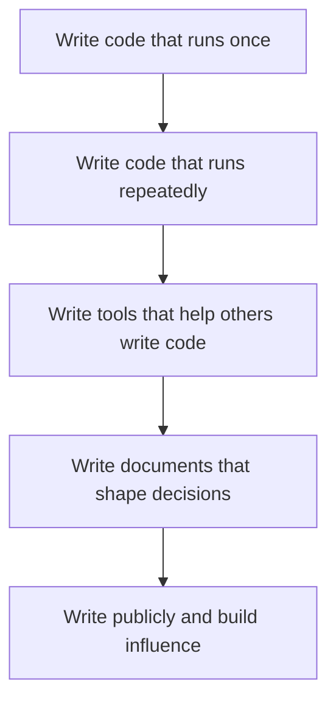

Today I was thinking about why some engineers have 10x the impact of others at the same level, and I landed on a simple hierarchy.

## The hierarchy

Not all engineering work creates equal leverage. Here's how I think about it, from lowest to highest:

1. **Code that runs once** — a migration script, a one-off analysis. Useful, but the value is consumed immediately.
2. **Code that runs repeatedly** — a pipeline, a service, a library. This is where most senior engineers live. Good leverage.
3. **Tools that help others write code** — frameworks, platforms, developer tooling. Now your work multiplies through other people.
4. **Documents that shape decisions** — design docs, RFCs, architecture principles. These scale beyond your team and outlast your tenure.
5. **Public writing** — blog posts, talks, open-source contributions. This scales beyond your company and compounds indefinitely.

## Why this matters

Most engineers optimize for level 2. That's fine — it's where the core work happens. But if you're a staff+ engineer and you're not spending meaningful time at levels 4 and 5, you're leaving leverage on the table.

The jump from level 2 to level 4 is the hardest. It requires shifting from "I built the thing" to "I shaped the direction." It feels less productive in the moment, but it's where principal-level impact comes from.

## The one-liner

Your leverage as an engineer is determined by how many people benefit from your work without you being in the room.
