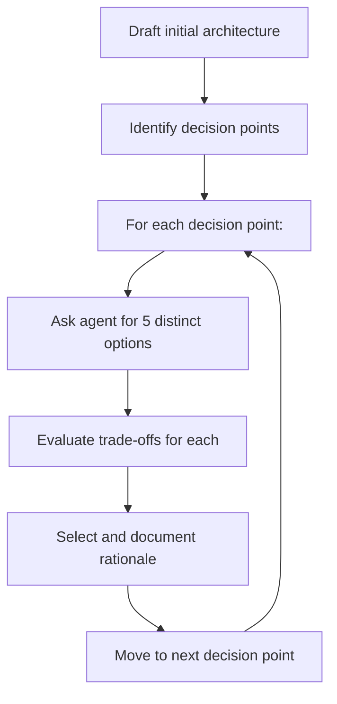

In my [[agentic-design-documents-with-kiro-cli|previous post]], I described using agents to research and synthesize technical designs. But I glossed over a critical step: how do you actually make the design *decisions*?

Most of us default to asking the agent for a recommendation. "What database should I use?" The agent picks one, explains why, and we move on. This is fast, but it's also how you end up with designs that feel obvious in hindsight — you never explored the alternatives.

I've been experimenting with a different approach: applying Tree of Thoughts (ToT) prompting to architecture decisions. The results have been noticeably better designs with clearer trade-off documentation.

## The research behind Tree of Thoughts

Tree of Thoughts comes from a [2023 paper by Yao et al.](https://arxiv.org/abs/2305.10601) that dramatically improved LLM problem-solving on tasks requiring exploration and backtracking. The key insight: instead of generating a single chain of reasoning, have the model explore multiple paths, evaluate which look promising, and prune dead ends.

The numbers are striking. On the "Game of 24" puzzle (find arithmetic operations to reach 24 from four numbers), GPT-4 with standard chain-of-thought prompting solved only 4% of problems. With Tree of Thoughts using a branching factor of 5, success jumped to 74%.

Why 5? The paper tested different branching factors and found that 5 candidates at each decision point hit a sweet spot — enough diversity to find good solutions, but not so many that evaluation becomes noisy. With 3 candidates, you often miss the best path. With more than 5, the evaluation step struggles to meaningfully differentiate options.

## Applying ToT to architecture

Software architecture is full of decision points where the first reasonable option isn't necessarily the best one. The trick is identifying *where* in your design these decision points live, then systematically exploring alternatives.

Here's the workflow I've landed on:

### Step 1: Identify decision points

Not every part of your architecture needs exploration. I look for:

- **Technology choices** — database, message queue, compute platform
- **Boundary decisions** — where to split services, what belongs in which component
- **Data flow patterns** — push vs. pull, sync vs. async, batch vs. stream
- **Consistency trade-offs** — strong vs. eventual, where to place the coordination

These are the places where reasonable engineers disagree, where the "right" answer depends on constraints you might not have fully articulated yet.

### Step 2: Request 5 options

For each decision point, I prompt the agent explicitly:

> "For [decision point], give me 5 options. For each option, describe the approach, strengths, and weaknesses."

Simple prompt, but a few things make it work:

The number 5 isn't arbitrary. The ToT research found that 5 candidates hit a sweet spot — enough diversity to cover the solution space, but not so many that you're drowning in noise. With 3 options, you often miss good alternatives. With 7 or more, the options start blurring together and evaluation becomes harder.

Asking for strengths *and* weaknesses upfront is important. If you only ask for options, the agent tends to present them neutrally or even advocate for each one. By explicitly requesting weaknesses, you get the critical perspective you need for evaluation. The agent knows the downsides — you just have to ask.

### Step 3: Evaluate and select (yourself)

This is the critical part: **you** evaluate the options, not the agent.

The agent is good at generating diverse alternatives and surfacing trade-offs you might not have considered. But it doesn't know your team's skills, your organization's risk tolerance, your operational constraints, or the political realities of your environment. Those factors often matter more than technical merit.

I review each option against my actual constraints:
- What does my team already know?
- What's our operational capacity to run this?
- What are the cost implications at our scale?
- What's the migration path from our current state?

The agent can help clarify trade-offs if I ask specific questions ("what's the operational overhead of running ClickHouse vs. using a managed service?"). But the ranking and final decision stays with me. Delegating that judgment to the agent is how you end up with technically correct but practically wrong architectures.

## An example: choosing a data store

Say I'm designing a system that needs to store time-series metrics with high write throughput and flexible querying. Instead of asking "what database should I use?", I ask for 5 options:

1. **TimescaleDB** — PostgreSQL extension, familiar SQL, good compression
2. **InfluxDB** — Purpose-built for time-series, excellent write performance
3. **ClickHouse** — Column-oriented, exceptional query speed at scale
4. **DynamoDB with TTL** — Managed, scales automatically, limited query flexibility
5. **S3 + Athena** — Cheapest at scale, highest query latency

Each option represents a different trade-off axis. TimescaleDB optimizes for developer familiarity. InfluxDB optimizes for write throughput. ClickHouse optimizes for analytical queries. DynamoDB optimizes for operational simplicity. S3 + Athena optimizes for cost.

Without the 5-option prompt, the agent might have jumped straight to InfluxDB (the "obvious" choice for time-series). But when I see all five options laid out, I can apply my own judgment: maybe my team already knows PostgreSQL well, making TimescaleDB the better fit despite InfluxDB's raw performance. Or maybe I know we'll need complex analytical queries down the road, pointing toward ClickHouse.

The agent surfaces options I might not have considered. The decision is mine.

## Why this works

The Tree of Thoughts research suggests that LLMs benefit from exploring multiple paths before committing. But the real value for architecture work isn't in the agent's evaluation — it's in the *option generation*.

When you ask for a single recommendation, you get the agent's best guess based on incomplete context. When you ask for 5 options, you get a map of the solution space. You can then navigate that map using knowledge the agent doesn't have: your team's strengths, your organization's constraints, your own experience with similar systems.

The 5-option constraint also produces better documentation. Instead of "we chose X because the agent recommended it," you get "we considered X, Y, Z, W, and V, and chose X because [your reasoning]." That's documentation that actually helps future readers understand the decision.

## The one-liner

For architecture decisions, ask your agent for 5 options instead of 1 — then use your own judgment to pick the right one.
